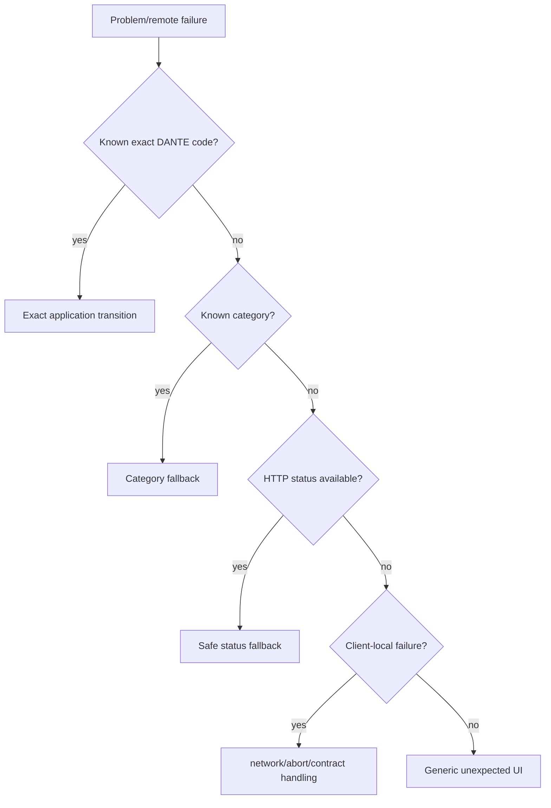

# DANTE Access/Auth API and Naming Contract

- **Status:** CURRENT / BRANCH-LOCAL AUTHORITATIVE / M2 CLOSED
- **Workstream:** `feature/access-auth`
- **Scope:** API namespace/versioning, operation semantics/naming, RFC 9457 problem responses, machine errors, OpenAPI ownership, generated-client contract and first-party Web/Native transport boundary accepted in M2.8/M2.10
- **Does not authorize:** concrete Auth endpoint/client implementation outside the separately gated M3 slice

This document owns the durable Access/Auth public application API and generated-client boundary. Concrete operation inventory is introduced slice-by-slice; this contract defines how those operations behave, are named, are documented and are consumed.

Companion authorities:

- `access-auth-architecture.md`;
- `access-auth-security-contract.md`;
- `access-auth-testing-contract.md`;
- `../decisions/ADR-011-access-auth-architecture.md`.

---

## 1. API boundary and versioning

Canonical product namespace:

```text
/api/v1/*
```

Normal Web shape:

```text
https://<canonical-app-origin>/api/v1/*
```

`v1` is the major compatibility generation of the application API, not the DANTE release number.

```text
DANTE application releases 1.x / 2.x / ...
may all use
/api/v1
```

A real incompatible public contract requires an explicit compatibility/version decision such as `/api/v2`. Additive compatible features do not increment URI version.

Technical health endpoints remain outside product API versioning:

```text
/health/live
/health/ready
```

---

## 2. Application-intent API, not persistence CRUD

Auth routes model application/security intents.

Preferred shape:

```text
POST   /api/v1/auth/signin
GET    /api/v1/auth/session
DELETE /api/v1/auth/session
POST   /api/v1/auth/reauthenticate
POST   /api/v1/auth/password/change
... slice-owned intents
```

Rejected default:

```text
POST /password_credentials
PATCH /auth_sessions/{row_id}
POST /external_identities
```

The public API does not expose PostgreSQL tables as CRUD resources merely because those tables exist.

---

## 3. Operation naming and identity

Operation names describe application/domain actions rather than framework/storage mechanics.

Use clear full words and stable DANTE concepts. Do not leak ORM/table names or invent abbreviations.

Every public operation has an explicit stable unique OpenAPI `operationId`.

Canonical style:

```text
auth_sign_in
auth_get_session
auth_log_out
auth_reauthenticate
auth_change_password
```

Python function identity is separate:

```text
Python refactor
handle_signin → execute_password_signin

must NOT silently rename
OpenAPI operationId / generated client operation
```

Once an operation spelling ships in API v1, cosmetic renaming is not permitted without compatibility treatment.

---

## 4. Layer-specific naming constitution

DANTE preserves semantic alignment while allowing each layer its normal idiom.

```text
HTTP path segments
→ lowercase, stable, intent/resource-oriented

OpenAPI operationId
→ stable namespaced snake_case

JSON public fields
→ snake_case

RFC 9457 extension members
→ snake_case

machine error codes
→ lowercase namespace.snake_case

Python
→ repository Python snake_case conventions

TypeScript generated client
→ generator-owned idiomatic symbols over wire-faithful DTOs

PostgreSQL
→ DANTE database naming constitution
```

PostgreSQL/API/TypeScript names are not forced to be textually identical merely to appear uniform.

---

## 5. Success response contract

No universal success wrapper such as:

```json
{"success": true, "data": {}}
```

Success responses are direct typed representations/results appropriate to the operation.

```text
GET representation
→ typed JSON model

mutation with meaningful resulting state
→ typed resulting representation/result

successful operation with no representation
→ 204 No Content
```

Do not add wrapper layers only for aesthetic uniformity.

---

## 6. Error standard: RFC 9457 Problem Details

Material API errors use:

```http
Content-Type: application/problem+json
```

DANTE adopts RFC 9457 Problem Details plus bounded machine-readable extensions.

Canonical shape:

```json
{
  "type": "https://<dante-problem-base>/auth/invalid-credentials",
  "title": "Authentication failed",
  "status": 401,
  "detail": "The supplied credentials could not be accepted.",
  "code": "auth.invalid_credentials",
  "category": "authentication",
  "request_id": "019c...",
  "retryable": false
}
```

RFC members:

```text
type
title
status
detail
instance when/if justified
```

DANTE extensions:

```text
code
category
request_id
retryable
errors[] when applicable
```

Human `title`/`detail` are not a machine contract.

---

## 7. Machine code is client authority

Clients never parse English error text to decide behavior.

Forbidden:

```text
if detail contains "password"
if title == "Authentication failed"
```

Required fallback chain:

```text
known exact code
→ known category
→ HTTP status class
→ generic safe fallback
```

Example code families:

```text
auth.invalid_credentials
auth.authentication_required
auth.reauthentication_required
auth.session_expired
auth.account_unavailable

request.malformed
request.validation_failed

security.csrf_failed

conflict.state_changed

rate_limit.exceeded

service.unavailable
dependency.unavailable

internal.unexpected
```

A slice adds only codes it truly needs.

### 7.1 Stability

Once a machine code ships in API v1, its semantic meaning is stable. Do not rename for aesthetics or reuse an old code for a new meaning.

New codes are normally additive.

---

## 8. Error category

Initial broad vocabulary:

```text
authentication
authorization
validation
conflict
rate_limit
security
dependency
service
internal
```

Category exists for forward-compatible fallback when an older first-party client receives a newer exact code.

---

## 9. Human text and localization

`title` and `detail` are safe human-readable fallback/support text, not DANTE i18n authority.

```text
machine code
→ Web/Mobile application mapping
→ DANTE i18n
→ localized copy
```

Backend may use safe English fallback while UI translation remains frontend-owned.

---

## 10. Validation problem shape

FastAPI/Pydantic internal validation payloads are not the stable public contract.

DANTE translates validation failures into RFC 9457 + bounded field errors.

```json
{
  "type": "https://<dante-problem-base>/request/validation-failed",
  "title": "Request validation failed",
  "status": 422,
  "code": "request.validation_failed",
  "category": "validation",
  "request_id": "019c...",
  "retryable": false,
  "errors": [
    {
      "pointer": "/password",
      "code": "too_short",
      "detail": "The value does not meet the minimum length.",
      "parameters": {
        "minimum": 15
      }
    }
  ]
}
```

### 10.1 Field pointer

Body-field `pointer` follows JSON Pointer semantics.

Query/path/header validation may use a separately documented bounded location representation; do not overload body JSON Pointer ambiguously.

### 10.2 Field error code

Public codes remain small, stable and implementation-independent, e.g.:

```text
required
invalid_format
too_short
too_long
invalid_value
```

Do not expose Pydantic/Python internal error class names.

### 10.3 Parameters

`parameters` exposes only safe values useful to presentation, e.g. `{"minimum": 15}`.

Never expose SQL constraint/table/column names, internal regexes, stack details or secret/security internals.

---

## 11. HTTP status semantics

Baseline:

```text
400 Bad Request
→ malformed protocol/body/request

401 Unauthorized
→ authentication missing/invalid/expired where auth is required

403 Forbidden
→ authenticated context forbidden, or safe security rejection such as CSRF

404 Not Found
→ absence where revealing it is intended/safe

409 Conflict
→ valid request conflicts with current canonical state

422 Unprocessable Content
→ syntactically valid request fails field/contract validation

429 Too Many Requests
→ rate limit / abuse control

500 Internal Server Error
→ unexpected internal failure

503 Service Unavailable
→ service/required dependency temporarily unavailable
```

HTTP status expresses protocol class; DANTE machine code expresses application meaning.

---

## 12. Anti-enumeration

### 12.1 Signin

Unknown email and known-email/wrong-password remain publicly equivalent:

```text
401
auth.invalid_credentials
same safe public semantics
```

Do not emit `auth.email_not_found` or `auth.password_wrong` before sufficient proof exists.

After a real credential has been proved, policy may expose a safe distinct Account-unavailable state because control evidence already exists.

### 12.2 Recovery initiation

Known and unknown addresses receive equivalent public recovery-request semantics, normally an accepted/neutral response rather than an account-existence error.

Anti-enumeration covers status/code/shape/resource/timing behavior where material, not merely wording.

---

## 13. Correlation/request identifier

Every API request receives a server-authoritative non-secret `request_id`.

```http
X-Request-ID: <opaque-id>
```

Problem body contains the same identifier.

Server logs/traces/security events correlate through it where appropriate.

Client-supplied `X-Request-ID` is not automatically authoritative. Any future `client_request_id`/idempotency key is a separate untrusted input concept.

```text
request_id != trace_id
```

Tracing infrastructure may correlate but does not define the public support identifier.

---

## 14. Retryability

Problem responses expose bounded `retryable` semantics.

```text
request.validation_failed  false
auth.invalid_credentials   false
rate_limit.exceeded        true
service.unavailable        true
```

Critical invariant:

```text
retryable=true
!= permission to blindly auto-retry a non-idempotent mutation
```

Mutation retry safety belongs to the transaction/idempotency contract.

Use standard `Retry-After` for 429 and applicable 503 responses.

---

## 15. Internal/security failure disclosure

Never expose:

```text
SQL text
constraint/table/column names
stack trace
sensitive Python exception detail
session/CSRF secret
provider code/token/assertion secret
expected secret values
internal hostnames/configuration
```

Unexpected failures use safe generic problem semantics such as:

```json
{
  "type": "https://<dante-problem-base>/internal/unexpected",
  "title": "Unexpected server error",
  "status": 500,
  "code": "internal.unexpected",
  "category": "internal",
  "request_id": "019c...",
  "retryable": false
}
```

Detailed diagnostics stay in protected telemetry linked by `request_id`.

---

## 16. External dependency failures

Temporary HIBP/provider/mail/etc. inability is normally represented by standard service-availability semantics plus machine code:

```text
503 Service Unavailable
+ dependency.unavailable
```

Do not adopt unusual/custom status codes merely because another API uses them if standard HTTP + machine code is clearer.

Fail-open/fail-closed behavior remains operation-specific under the security contract.

---

## 17. Protocol endpoints vs normal application JSON

Normal DANTE application operations use typed JSON where a body is required.

External provider callbacks may require provider-defined HTTP methods/content types/form payloads.

```text
external protocol endpoint
→ validate exact provider/protocol contract
→ immediately translate into DANTE application intent/evidence
```

Do not distort an external protocol merely to make every route aesthetically JSON-only.

---

## 18. OpenAPI is a governed contract artifact

Every material operation describes:

```text
request model
success response(s)
meaningful problem response(s)
content types
security requirements
stable operationId
```

Do not ship an endpoint whose OpenAPI documents only `200` while runtime emits undocumented 401/403/409/422/429/503 semantics.

FastAPI/Pydantic API declarations are the source of the generated OpenAPI artifact; the committed OpenAPI snapshot is governed/generated, not hand-authored independent truth.

OpenAPI generation must be deterministic and must not require live PostgreSQL, remote providers, Internet or production secrets.

---

## 19. Generated client authority

ADR-008 selected FastAPI OpenAPI → Orval when a real product API exists. M3 is the activation trigger.

Canonical chain:

```mermaid
flowchart TD
    B[FastAPI/Pydantic API declarations] --> O[OpenAPI 3.1 snapshot]
    O --> R[Orval Fetch generation]
    R --> C[@dante/api-client]
    C --> W[Web transport adapter]
    C --> N[Native transport adapter later]
```

Authority:

```text
FastAPI/Pydantic API declarations   source
OpenAPI snapshot                    generated + committed
Orval TS/Zod output                 generated + committed
```

Generated files are never hand-edited.

---

## 20. Orval/client mode

DANTE uses Orval's Fetch-oriented client generation.

Not selected as the core generated API boundary:

```text
Axios
Orval-generated React hooks
Orval-generated TanStack Query hooks
```

Exact Orval version is pinned/qualified during M3 materialization on the then-current stable compatible line.

`@dante/api-client` remains framework-neutral and must not depend on React/TanStack Query/router/platform storage.

---

## 21. `@dante/api-client` ownership

The package activates only when M3 provides real OpenAPI and first-party consumers.

It owns:

```text
generated DTOs/schemas
operation transport contract
runtime validated wire responses/problems
public generated-client package boundary
```

It does not own:

```text
browser auth state
cookie parsing
CSRF lifecycle
localStorage/sessionStorage
React UI/query policy
routing/navigation
Native secure storage
provider flow orchestration
feature-specific state transitions
```

No handwritten giant `DanteApi` god-object duplicates the generated contract.

---

## 22. Transport injection

Generated operations use a runtime/injected transport boundary.

### 22.1 Web adapter

Web-specific adapter owns:

```text
relative same-origin API URL
credentials=same-origin
X-Dante-CSRF injection for applicable unsafe authenticated requests
AbortSignal propagation
safe Accept/content-type headers
```

It does not globally redirect/navigate on 401/403. Application/session policy decides what those responses mean.

### 22.2 Native adapter

M6 reuses the same generated first-party API contract through a Native adapter owning:

```text
configured API origin
native-safe credential transport
secure-storage integration outside generated code
no browser-CSRF semantics
```

Browser-cookie semantics never become the application/domain model.

---

## 23. Base URL/deployment separation

Generated Web operations use relative `/api/v1/...` paths.

Never hardcode:

```text
https://prod.<domain>/...
```

inside generated client source.

Web resolves relative same-origin. Native adapter may prepend configured native API origin.

```text
API contract != deployment location
```

---

## 24. Generated response handling

The generated/client boundary retains enough raw HTTP metadata to consume:

```text
status
headers
Content-Type
X-Request-ID
Retry-After
RFC 9457 body
```

Do not force all responses into a success-only abstraction.

A single normalization boundary converts wire-level outcomes into application-level remote results.

Conceptually:

```text
RemoteResult<T>

success
→ value

failure
→ server_problem
   ├── code
   ├── category
   ├── requestId
   ├── retryable
   └── fieldErrors

→ network_unavailable
→ aborted
→ contract_violation
```

Client-local transport/contract failures are not fabricated DANTE server machine codes.

---

## 25. Runtime validation

TypeScript typing alone is insufficient for runtime JSON.

DANTE uses the already-selected Zod runtime-validation capability at the generated/normalized client boundary.

```text
valid expected response
→ continue

server payload violates schema
→ contract_violation
→ safe application handling + telemetry
```

If Orval runtime validation cannot cover a specific problem/status branch cleanly, implement one governed parser at the client boundary rather than repeated feature-local parsing.

---

## 26. Wire naming and model separation

Public JSON remains `snake_case` and generated wire DTOs remain faithful to it.

Do not apply an implicit recursive global snake→camel transform across arbitrary JSON/problem/provider objects.

Application models may explicitly map to idiomatic TypeScript names.

Permanent separation:

```text
SQLAlchemy persistence mapping
!= application result/model
!= API DTO
!= generated TypeScript DTO
!= frontend application model
```

FastAPI response models form part of the explicit output/security boundary; persistence objects are not serialized directly as the public contract.

---

## 27. OpenAPI snapshot and deterministic generation

The generated OpenAPI snapshot is committed because it is:

```text
reviewable
diffable
offline/local generator input
independent of a running remote environment
suitable for deterministic drift detection
```

It remains generated state, not a second source of truth.

Canonical regeneration:

```text
FastAPI application source
→ app/openapi export
→ committed OpenAPI snapshot
→ Orval
→ committed TS/Zod generated client
```

CI uses local snapshot input, never a DEV/UAT OpenAPI URL.

---

## 28. Generated-source drift

Extend the existing DANTE `generated:check` philosophy.

CI must fail when:

```text
backend API declarations changed / OpenAPI snapshot stale
OpenAPI changed / Orval output stale
generated TS hand-edited
operationId duplicates/accidental rename make generation inconsistent
generated client no longer compiles/runtime-validates
```

Generation runs without live DB/network/secrets and leaves no repository residue.

---

## 29. Web remote-state boundary

M3 activates TanStack Query because real remote session/request state exists.

Ownership:

```text
backend/PostgreSQL
→ canonical auth/session truth

TanStack Query
→ remote request/cache lifecycle

Access application/reducer
→ product/UI flow
```

Global session/bootstrap state is separate from one form reducer.

Query keys are application-owned semantic identities, not generated HTTP-route strings.

Auth query-cache persistence to localStorage/IndexedDB is not selected.

Automatic blind mutation retry is not selected for signin/logout/reauth. Safe idempotent reads may use bounded transient-failure retry under application policy.

Background bootstrap/refetch does not count as server-side user activity.

---

## 30. Feature data firewall

Required dependency direction:

```text
Access presentation/state
→ Access application boundary
→ remote/session data source
→ @dante/api-client
→ Web/Native transport adapter
```

Forbidden:

```text
UI/reducer → raw fetch
UI/reducer → generated Orval internals directly
UI → cookie/CSRF/storage internals
handwritten duplicate API DTO/client
```

M3 is the trigger to extend executable frontend architecture enforcement to the newly materialized feature/public-API/data-source/generated-client boundaries.

---

## 31. Client error-handling model



Access preserves:

```text
REQUEST_* = user intent
SERVER_*  = authoritative backend result
```

No click/request event may manufacture authenticated/verified/recovered state.

---

## 32. Testing and proof

Detailed requirements live in `access-auth-testing-contract.md`.

M3 must directly prove:

```text
deterministic OpenAPI snapshot
deterministic Orval output
TypeScript/Zod generated contract
FastAPI problem/status/header behavior
same-origin Web transport/CSRF/cookie behavior
application error mapping
real full-stack browser signin/bootstrap/logout
```

---

## 33. Benchmark basis

The contract was pressure-tested against current public guidance including:

- OpenAPI 3.1;
- RFC 9457;
- FastAPI OpenAPI/response-model/client-generation guidance;
- Orval v8 capabilities/current stable family at M2 review time;
- TanStack Query current first-party remote-state patterns;
- Google API Improvement Proposals;
- Microsoft API guidelines;
- Stripe/GitHub public API conventions where materially comparable.

DANTE is building a serious first-party Web/Android/iOS API contract. It is not required in M3 to materialize the separate developer-platform machinery of a global third-party public API (developer portal, external API keys/OAuth apps, multi-language public SDK lifecycle, third-party quotas/webhooks) before a real product need exists.

The present first-party API/OpenAPI/client structure deliberately keeps that future possibility open.

---

## 34. Rejected API/client shortcuts

```text
unversioned forever-contract
release-number-in-URI versioning
CRUD exposure of Auth tables
universal success/data envelope
frontend parsing English errors
opaque numeric ERR_0042 codes
Pydantic internals as public validation semantics
raw exception/SQL detail
client-controlled canonical request ID
retryable interpreted as blind mutation auto-retry
undocumented material error responses
operationId accidental Python-name coupling
provider callback protocol distorted for JSON uniformity
handwritten duplicate TS API contract
remote DEV OpenAPI as CI generator authority
Axios introduced only for generated client
React/TanStack generated hooks as canonical API layer
hardcoded PROD base URL
cookie/CSRF/secure-storage ownership in generated package
persisted Auth query cache
implicit global wire-case conversion
```

---

## 35. M2 closure

M2.8 and M2.10 are accepted and reconciled. No remaining API/generated-client architectural decision blocks M3.

M2 closure does not claim any endpoint/OpenAPI/package runtime implementation exists yet. Those are M3 executable obligations under a separate write gate.