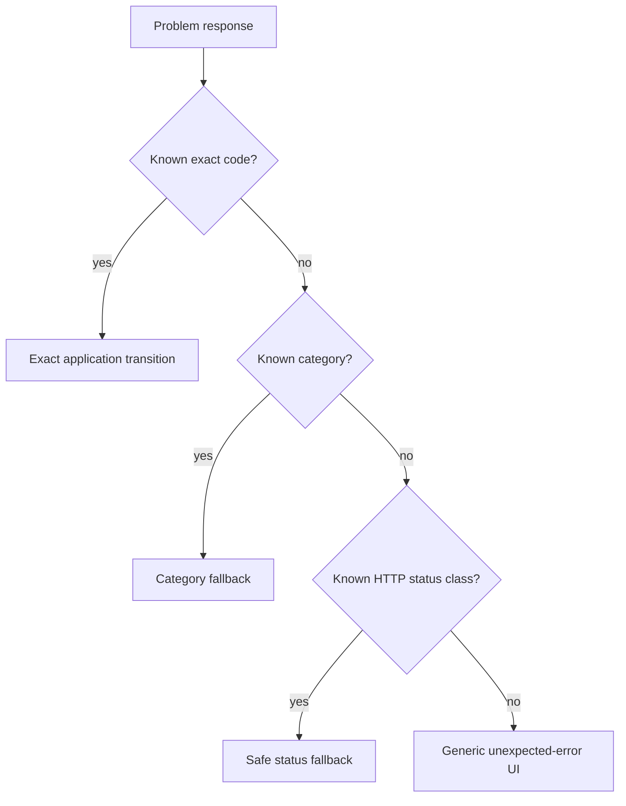

# DANTE Access/Auth API and Naming Contract

- **Status:** CURRENT / BRANCH-LOCAL AUTHORITATIVE FOR ACCEPTED M2.8 DECISIONS
- **Workstream:** `feature/access-auth`
- **Scope:** API namespace/versioning, operation semantics/naming, RFC 9457 problem responses, machine errors, validation, anti-enumeration, correlation IDs and OpenAPI obligations
- **Does not authorize:** concrete Auth endpoints/client generation before M2 closure

This document owns the durable API/naming contract already accepted for Access/Auth. Concrete endpoint inventory is introduced slice-by-slice; this contract defines how those endpoints must behave and be named.

---

## 1. API boundary and versioning

The canonical product API namespace is:

```text
/api/v1/*
```

For the normal same-origin Web boundary:

```text
https://<canonical-app-origin>/api/v1/*
```

`v1` is the major compatibility generation of the API contract. It is not the DANTE application release version.

```text
application release 1.4 / 1.8 / 2.x
may all consume
/api/v1
```

A real incompatible contract requires a deliberate compatibility/version decision such as `/api/v2`; additive compatible features do not increment the URI version.

Technical health endpoints remain outside product API versioning:

```text
/health/live
/health/ready
```

---

## 2. Application-intent API, not persistence CRUD

Auth routes model application/security intents.

Preferred shape:

```text
POST   /api/v1/auth/signin
GET    /api/v1/auth/session
DELETE /api/v1/auth/session
POST   /api/v1/auth/reauthenticate
POST   /api/v1/auth/password/change
... future slice-owned intents
```

Rejected shape:

```text
POST /password_credentials
PATCH /auth_sessions/{row_id}
POST /external_identities
```

The public API does not expose database tables as CRUD resources merely because those tables exist.

### 2.1 Naming principle

Operation names describe domain/application actions rather than implementation mechanics.

Use clear full words and stable concepts already defined by DANTE:

```text
sign_in / signin        one chosen API spelling, then stable
log_out / logout        one chosen API spelling, then stable
reauthenticate
revoke_session
change_password
request_recovery
```

Do not invent abbreviations or leak storage/framework names.

The exact endpoint/operation spelling for each new slice is ratified with that slice, then becomes stable within API v1.

---

## 3. Operation identity and OpenAPI `operationId`

Every public operation has an explicit stable unique OpenAPI `operationId`.

Canonical style:

```text
auth_sign_in
auth_get_session
auth_log_out
auth_reauthenticate
```

The stable API operation identity is separate from the Python handler function name.

```text
Python refactor
handle_signin → execute_password_signin

must NOT silently rename
OpenAPI operationId / generated client operation
```

This protects generated clients from accidental SDK breaking changes caused by backend refactors.

---

## 4. Layer-specific naming constitution

DANTE does not force one textual convention across unrelated languages/layers. Semantic meaning must remain aligned while each layer follows its idiom.

```text
HTTP path segments
→ lowercase, stable, intent/resource-oriented

OpenAPI operationId
→ stable snake_case namespaced by capability

JSON field names
→ snake_case for backend/public contract unless a repo-wide generated-client convention explicitly transforms them

RFC 9457 extension members
→ snake_case

machine error codes
→ lowercase namespace.snake_case

Python
→ repository Python conventions / snake_case symbols

TypeScript generated client
→ generator-owned idiomatic API; never handwritten duplicate contract

PostgreSQL
→ DANTE PostgreSQL naming constitution; API naming never overrides DB semantics
```

Semantic consistency is mandatory; textual sameness is not.

---

## 5. Success response contract

DANTE does not use a universal success envelope such as:

```json
{"success": true, "data": {}}
```

Success responses are direct typed models appropriate to the operation.

Examples:

```text
GET representation
→ typed JSON response

mutation with meaningful resulting state
→ typed resulting representation or operation result

successful operation with no representation
→ 204 No Content
```

Do not add wrapper layers solely for visual uniformity.

---

## 6. Error standard: RFC 9457 Problem Details

Material API errors use:

```http
Content-Type: application/problem+json
```

DANTE adopts RFC 9457 Problem Details as the base format and adds bounded machine-readable extensions.

Canonical shape:

```json
{
  "type": "https://<dante-problem-base>/auth/invalid-credentials",
  "title": "Authentication failed",
  "status": 401,
  "detail": "The supplied credentials could not be accepted.",
  "code": "auth.invalid_credentials",
  "category": "authentication",
  "request_id": "019c...",
  "retryable": false
}
```

RFC fields:

```text
type
title
status
detail
instance when/if later justified
```

DANTE extension members:

```text
code
category
request_id
retryable
errors[] when field/sub-errors apply
```

---

## 7. Machine code is client authority

Clients must never infer behavior by parsing human text.

Forbidden:

```text
if detail contains "password"
if title == "Authentication failed"
if English message starts with ...
```

Required:

```text
switch on stable machine code
→ fallback to category
→ fallback to HTTP status
→ final generic safe behavior
```

Example code families:

```text
auth.invalid_credentials
auth.authentication_required
auth.reauthentication_required
auth.session_expired
auth.account_unavailable

request.malformed
request.validation_failed

security.csrf_failed

conflict.state_changed

rate_limit.exceeded

service.unavailable
dependency.unavailable

internal.unexpected
```

This list is illustrative/current direction, not permission to pre-create unused codes. A slice introduces only the codes it truly needs.

### 7.1 Stability

Once a machine code ships as part of API v1, its semantic meaning is stable.

Renaming a code for aesthetics is not allowed if clients already depend on it.

New codes are normally additive. Reusing an old code for a new meaning is a breaking contract.

---

## 8. Error category

`category` provides a broader forward-compatible fallback.

Initial category vocabulary:

```text
authentication
authorization
validation
conflict
rate_limit
security
dependency
service
internal
```

A client that does not yet know a new exact code can still render sensible behavior from the stable category and HTTP status.

---

## 9. Human text and localization

`title` and `detail` are safe human-readable fallback/support text.

They are not the frontend i18n authority.

```text
machine code
→ DANTE Web/Mobile i18n
→ localized user-facing message
```

The backend may use safe English fallback text while IT/EN UI copy remains owned by frontend localization contracts.

This avoids coupling backend deployments to translated presentation text.

---

## 10. Validation problem shape

FastAPI/Pydantic's internal validation payload is not exposed as the permanent public contract.

DANTE translates validation failures into RFC 9457 + structured bounded field errors.

Example:

```json
{
  "type": "https://<dante-problem-base>/request/validation-failed",
  "title": "Request validation failed",
  "status": 422,
  "code": "request.validation_failed",
  "category": "validation",
  "request_id": "019c...",
  "retryable": false,
  "errors": [
    {
      "pointer": "/password",
      "code": "too_short",
      "detail": "The value does not meet the minimum length.",
      "parameters": {
        "minimum": 15
      }
    }
  ]
}
```

### 10.1 Field pointer

`pointer` follows JSON Pointer semantics for body fields where applicable.

Other input locations may use a separately documented bounded representation if query/path/header errors need it; do not overload body JSON Pointer with ambiguous syntax.

### 10.2 Field error codes

Public field-error codes are small, stable and implementation-independent, for example:

```text
required
invalid_format
too_short
too_long
invalid_value
```

Do not expose Pydantic/Python internal error class names as stable API semantics.

### 10.3 Parameters

`parameters` may expose only safe values useful to client presentation, e.g.:

```json
{"minimum": 15}
```

Never expose SQL constraint names, stack details, internal regexes, database columns or secret/security internals.

---

## 11. HTTP status semantics

Baseline use:

```text
400 Bad Request
→ malformed request/protocol/body that cannot be processed as the expected request

401 Unauthorized
→ authentication missing/invalid/expired where authentication is required

403 Forbidden
→ authenticated context exists but operation is forbidden, or safe security-policy rejection such as CSRF failure

404 Not Found
→ resource/route semantics where revealing absence is safe and intended

409 Conflict
→ valid request conflicts with current authoritative state

422 Unprocessable Content
→ syntactically valid request fails contract/field validation

429 Too Many Requests
→ rate limit / abuse control

500 Internal Server Error
→ unexpected internal failure

503 Service Unavailable
→ service or required dependency temporarily unavailable
```

HTTP status expresses protocol-level class. DANTE machine code expresses application meaning.

Do not invent arbitrary custom statuses when standard HTTP semantics plus machine code are clearer.

---

## 12. Anti-enumeration

Error specificity must never become an account-existence oracle.

### 12.1 Sign-in

Public behavior for:

```text
unknown email
known email + wrong password
```

is intentionally equivalent:

```text
401
auth.invalid_credentials
same safe human semantics
```

Do not emit:

```text
auth.email_not_found
auth.password_wrong
```

before sufficient proof exists.

After a real credential has been proven, the application may expose a distinct safe state such as account unavailable/disabled when policy allows because the attacker has already demonstrated account control evidence.

### 12.2 Recovery initiation

Known and unknown email inputs receive equivalent public recovery-request semantics, typically an accepted/neutral response rather than an account-existence error.

Anti-enumeration is an end-to-end behavioral requirement including status, code, response shape and timing/resource controls where material—not merely a generic message string.

---

## 13. Correlation/request identifier

Every API request receives a server-authoritative non-secret `request_id`.

Response header:

```http
X-Request-ID: <opaque-id>
```

Problem body:

```json
{"request_id": "<same-id>"}
```

Server logs/traces/security events correlate through the same request identifier where appropriate.

### 13.1 Client input

A client-supplied `X-Request-ID` is not automatically accepted as DANTE's canonical request identity.

If a future `client_request_id`/idempotency identifier is supported, it is a separate untrusted input concept.

### 13.2 Request ID vs trace ID

```text
request_id != trace_id
```

They may correlate, but tracing infrastructure does not define the public support/debugging identifier.

---

## 14. Retryability

Problem responses include a bounded `retryable` Boolean describing whether a later retry may generally succeed without changing the submitted semantic request.

Examples:

```text
request.validation_failed  retryable=false
auth.invalid_credentials   retryable=false
rate_limit.exceeded        retryable=true
service.unavailable        retryable=true
```

Critical rule:

```text
retryable=true
!=
client is allowed to blindly auto-retry a non-idempotent mutation
```

Mutation retry safety depends on operation semantics and idempotency support, owned by the transaction/concurrency contract.

For 429 and applicable 503 responses use standard `Retry-After` semantics where useful.

---

## 15. Security and internal failure disclosure

Unexpected internals never cross the public boundary.

Forbidden public detail:

```text
SQL text
constraint/table/column names
stack trace
Python exception class where sensitive/unnecessary
session or CSRF secret
provider code/token/assertion detail
expected secret values
internal hostnames/configuration
```

Canonical unexpected failure shape is safe and generic, for example:

```json
{
  "type": "https://<dante-problem-base>/internal/unexpected",
  "title": "Unexpected server error",
  "status": 500,
  "code": "internal.unexpected",
  "category": "internal",
  "request_id": "019c...",
  "retryable": false
}
```

The server keeps detailed diagnostics in protected telemetry linked to `request_id`.

---

## 16. External dependency failures

Temporary provider/mail/HIBP/etc. inability is normally represented using standard service availability semantics plus a machine code:

```text
503 Service Unavailable
+ dependency.unavailable
```

DANTE does not adopt WebDAV-oriented/custom statuses merely because another API uses them if standard HTTP + code is clearer.

The exact fail-open/fail-closed security behavior remains operation-specific; for example password establishment and existing-password breach intelligence intentionally differ in the security contract.

---

## 17. Protocol endpoints vs normal application JSON

Normal DANTE application operations use typed JSON contracts where a body is required.

External provider callbacks may require provider-defined HTTP methods/content types/form payloads.

Rule:

```text
external protocol endpoint
→ validate exact provider/protocol contract
→ immediately translate into DANTE application intent/evidence
```

Do not distort an external protocol merely to make every endpoint aesthetically JSON-only.

---

## 18. OpenAPI obligations

OpenAPI is a real contract artifact, not documentation generated after implementation.

Every material operation must describe:

```text
request model
success response(s)
meaningful problem response(s)
content types
security requirements
stable operationId
```

Do not ship endpoints where OpenAPI documents only `200` while runtime produces undocumented 401/403/409/422/429/503 behavior.

Generated-client drift must be detectable in the repository/CI contract finalized in M2.10/M3.

---

## 19. Client error handling model

Canonical client decision flow:



Example Access integration:

```text
auth.invalid_credentials
→ invalid-credentials state

auth.reauthentication_required
→ reauth state/flow

rate_limit.exceeded
→ rate-limited state, respect Retry-After

service.unavailable
→ degraded/server-unavailable state
```

The frontend state machine still obeys:

```text
REQUEST_* = user intent
SERVER_*  = backend-authoritative result
```

---

## 20. API naming benchmark basis

The naming/contract direction was cross-checked with mature public API guidance:

- OpenAPI 3.1 — unique stable operation identifiers and machine-readable schema contracts;
- RFC 9457 — Problem Details, extension members and non-parsing of human `detail` text;
- Google API Improvement Proposals — clear action/resource naming and custom methods where standard CRUD semantics do not fit;
- Microsoft API guidelines — descriptive names, stable machine error semantics and avoiding unnecessary abbreviation;
- Stripe public API — HTTP status + machine code + human message + request ID separation;
- GitHub REST API — structured validation/errors and standard HTTP status usage.

External API conventions are benchmark evidence. DANTE keeps its own semantic vocabulary and does not copy provider-specific legacy quirks.

---

## 21. Rejected API shortcuts

```text
unversioned product API as implicit forever-contract
release-number-in-URI versioning
CRUD exposure of Auth tables
universal success/data envelope
frontend parsing English errors
numeric opaque ERR_0042 codes
Pydantic internal errors as public contract
raw exceptions/SQL details in responses
client-controlled canonical request ID
retryable flag interpreted as blind mutation auto-retry
undocumented material error responses
operationId derived accidentally from Python function names
provider callback protocol rewritten for aesthetic uniformity
```

---

## 22. Open decisions beyond this checkpoint

M2.8 is accepted. Still open:

```text
M2.9  M3 transaction/concurrency/session-expiry behavior
M2.10 exact OpenAPI → generated client → Web application boundary and toolchain
M2.11 exact M3 test matrix/full-stack harness
```

M2.10 may refine generator-specific TypeScript naming, generated-file ownership and CI drift mechanics. It must not silently violate the stable API semantics established here.