# DANTE Access/Auth Architecture Contract

- **Status:** CURRENT / BRANCH-LOCAL AUTHORITATIVE / M2 CLOSED
- **Workstream:** `feature/access-auth`
- **Scope:** Access/Auth identity, authenticator, session, Web/Native, transaction, generated-client and application boundaries accepted in M2.1–M2.11
- **Does not authorize:** implementation outside the separately gated M3 slice

This document states the current Access/Auth architecture directly by subject. It is not a chronology of M2 discussion. The workstream remains the operational save-game; this document owns durable architectural meaning.

Companion authorities:

- `access-auth-security-contract.md` — security policy and lifecycle;
- `access-auth-api-contract.md` — HTTP/OpenAPI/generated-client contract;
- `access-auth-testing-contract.md` — proof/CI/full-stack harness contract;
- `../decisions/ADR-011-access-auth-architecture.md` — accepted rationale and rejected alternatives.

All implementation must also preserve stronger current DANTE Domain/Logical/Physical, ADR-007, ADR-008, ADR-009, ADR-010 and PostgreSQL/database authorities.

---

## 1. Architectural objective

DANTE Access/Auth must support a consumer-grade first-party product across Web, Android and iOS without collapsing authentication into the Domain model or binding the product to one credential type.

The architecture must support, without semantic rewrite:

```text
password authentication
Google authentication
Apple authentication
passkeys / WebAuthn
multiple concurrent Web/Native sessions
reauthentication / sensitive-operation step-up
recovery/reset
explicit provider linking
future optional MFA/TOTP/recovery-code policy
future account/session security management
```

Core non-collapse rules:

```text
Person != Account != Principal != Actor
AuthSession != DANTE Session
signin != provider-data integration authorization
provider identity != provider email
client/device signal != identity
frontend request/success != backend-authoritative success
method != factor != assurance
```

---

## 2. Canonical conceptual model

`Account` is the durable Access/security root. It is not a profile, Person, runtime Principal, global role, device, email or password row.

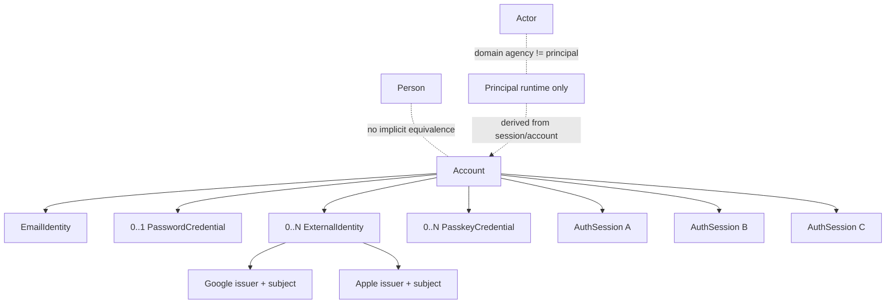

Conceptual names are not pre-approved SQL table names. Persistence appears only when a vertical slice justifies exact schema semantics.

### 2.1 Account

Account owns stable access/security lifecycle state.

Do not place directly on Account merely for convenience:

```text
password hash
email as primary key
Google/Apple subject
passkey protocol payload
raw session secret
Person profile fields
workspace/global role
device identity
```

Initial lifecycle distinguishes at least usable/active from disabled/unavailable. Email verification, setup completion, password presence and account availability remain independent facts.

### 2.2 Person

`Person` remains the DANTE Domain/native human identity concept. Access/Auth must not retrofit login/password semantics into Person.

No Account↔Person 1:1 relation is inferred merely because the consumer user is normally human. Any future binding requires explicit semantics and justification.

### 2.3 Principal

Principal is a request-runtime security context derived from current Account/AuthSession/security/authorization state.

A durable Principal table is not selected.

Conceptually:

```text
Principal
├── account_ref
├── auth_session_ref
├── authentication/recent-auth context
├── verified security properties
└── request-scoped authorization context
```

### 2.4 Actor

Actor remains a Domain agency concept. Authentication does not imply `Principal == Actor`.

---

## 3. Identity and credential decomposition

DANTE does not model `Account = email + password`.

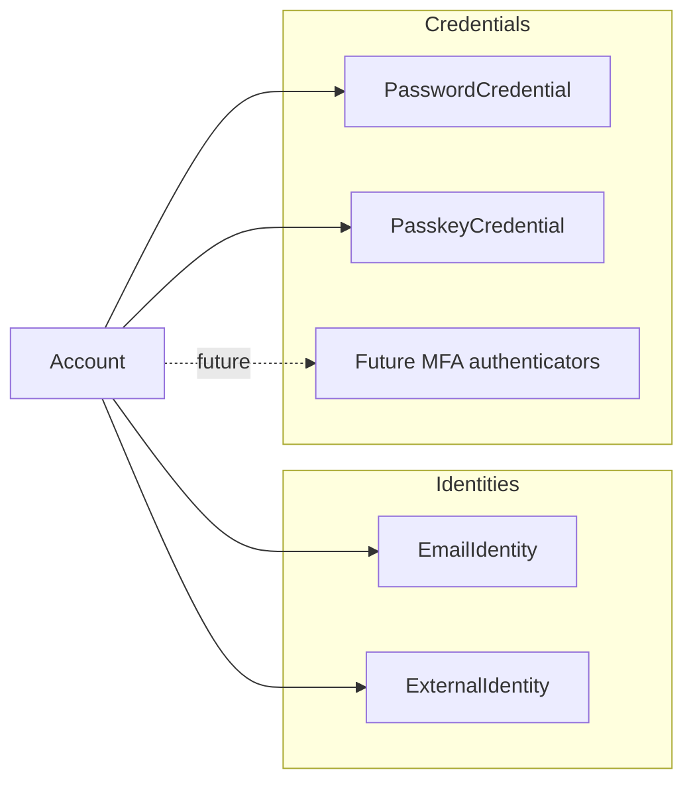

### 3.1 EmailIdentity

Email is a separately governed identity/contact/recovery concept.

Current consumer invariant:

```text
standard consumer Account
→ maintains at least one verified recovery/contact EmailIdentity
```

This remains true for provider-only or passkey-only authentication unless a later product/security decision explicitly replaces the recovery/contact invariant.

### 3.2 PasswordCredential

Password is optional:

```text
Account → 0..1 current PasswordCredential
```

No architecture may assume every Account has a password.

### 3.3 ExternalIdentity

Federated identity key:

```text
issuer + subject
```

Provider email is evidence/metadata, never the canonical federated key.

Email coincidence never silently merges Accounts.

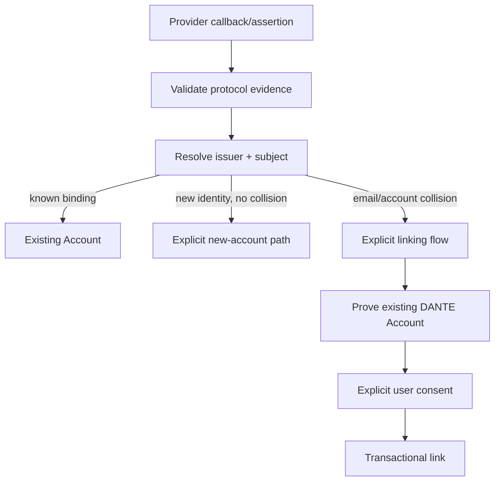

### 3.4 PasskeyCredential

```text
Account → 0..N PasskeyCredential
```

Passwordless Accounts are valid. Passkey is not synonymous with MFA; it may satisfy primary signin or future step-up/MFA policy according to ceremony properties and DANTE policy.

---

## 4. Authentication evidence and policy boundary

Authenticator-specific code verifies evidence. It does not own session creation.

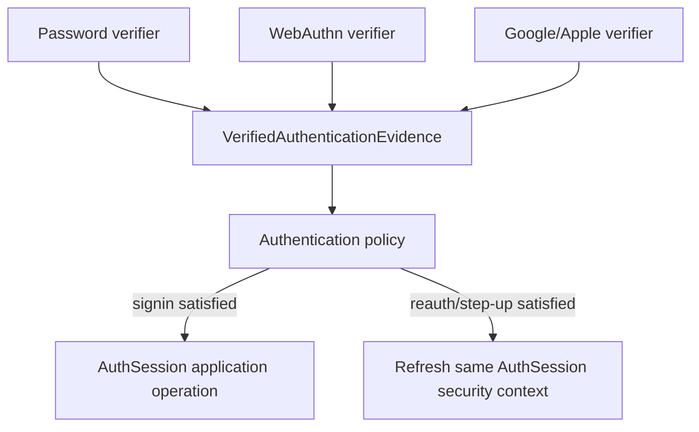

Verified evidence may conceptually expose:

```text
account
method
verified_at
user verification performed?
phishing resistant?
factor capabilities
protocol-specific trusted properties
```

This is an application/security abstraction, not permission to create one generic polymorphic authenticator table.

### 4.1 Method, factor, assurance

```text
Authentication Method != Authentication Factor != Authentication Assurance
```

Do not use one permanent `mfa_enabled` Boolean as the complete future security model.

### 4.2 Compliance labels

NIST assurance levels are engineering benchmarks. DANTE must not claim `AAL2` or similar unless every applicable requirement is actually implemented and proved. Store/evaluate concrete properties instead of borrowing compliance labels.

---

## 5. AuthSession

DANTE supports multiple independent sessions per Account.

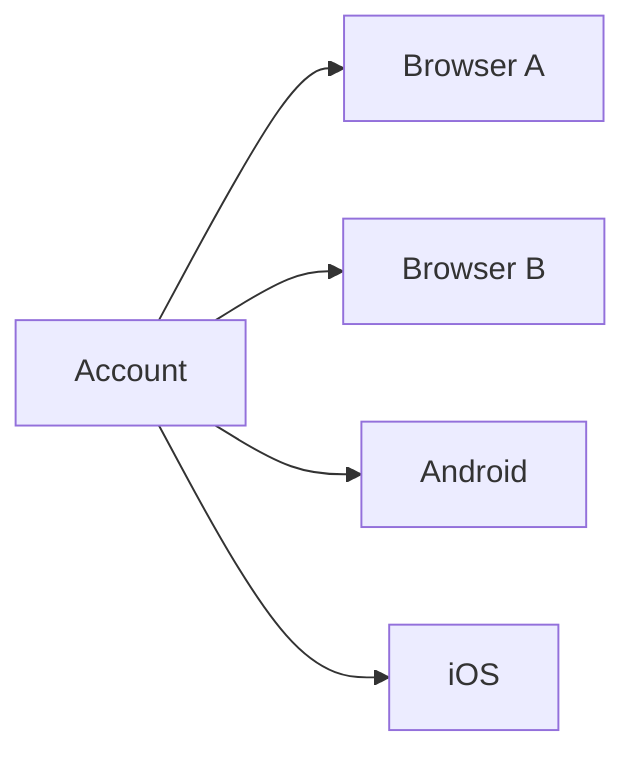

Each AuthSession has independent secret, expiry and revocation lifecycle.

Required conceptual capabilities include:

- stable non-secret AuthSession reference;
- independent secret/verifier;
- created/authenticated/recent-auth timestamps as justified;
- overall and inactivity expiry semantics;
- user activity distinct from background polling;
- independent revocation;
- safe session/client metadata for future management UX;
- sufficient authentication-evidence context for current policy without turning the row into a permanent audit log.

Raw session secrets are never durable server-side state.

### 5.1 Session actions

```text
LOG OUT
→ revoke current AuthSession

REVOKE SESSION X
→ revoke only X

REVOKE ALL OTHER SESSIONS
→ current survives

LOG OUT EVERYWHERE
→ revoke all, including current
```

These are distinct application intents.

### 5.2 Reauthentication

Reauthentication keeps the same AuthSession identity.

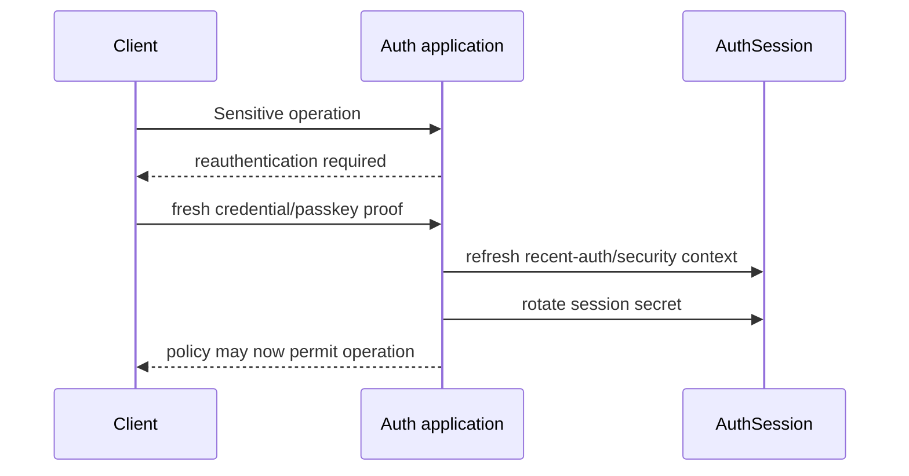

Recent-auth remains assurance-aware; a timestamp alone is not the permanent abstraction.

---

## 6. Security lifecycle semantics

### 6.1 Current logout

```text
current AuthSession → revoked
browser/native credential → cleared/invalid
operation → idempotent
```

### 6.2 Authenticated password change

Requires valid session + recent authentication.

```text
replace PasswordCredential
+ revoke all other AuthSessions
+ retain initiating AuthSession when continuity is valid
+ rotate initiating session secret
```

### 6.3 Password recovery/reset

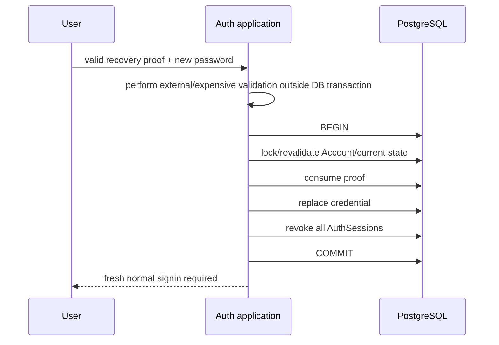

No auto-login after recovery reset.

### 6.4 Account disable

Account disable atomically makes Account unavailable and revokes all active sessions. Re-enable never resurrects historical sessions.

### 6.5 Authenticator add/remove

Adding/removing security-sensitive authenticators requires appropriate recent authentication and emits security-event/notification capability.

Removing an authenticator must use proof that remains valid after removal where applicable and must not leave the Account without a usable access/recovery path.

Normal maintenance and compromise are distinct flows; compromise may justify broader session revocation than ordinary maintenance.

---

## 7. Web deployment boundary

Normal browser security topology is same-origin even when React and FastAPI are physically/deployment independent.

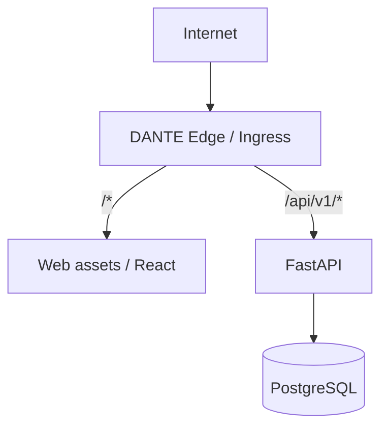

Canonical browser-facing shape:

```text
https://<canonical-app-origin>/
https://<canonical-app-origin>/api/v1/*
```

The edge hides physical service topology. Browser direct cross-origin credentialed API access is not the default. Normal Web CORS is disabled/no ACAO.

A future dedicated native/public API hostname remains possible without changing Account/AuthSession semantics.

### 7.1 Local development/test

The browser still observes same-origin through reverse proxy/test ingress:

```text
Web origin
/api/* → FastAPI
```

Do not widen CORS merely because internal local processes use different ports.

### 7.2 Proxy trust

Security-sensitive forwarded headers are trusted only from the configured trusted edge/proxy. Internet-supplied forwarding headers are never blindly authoritative.

---

## 8. Web vs Native transport

Session semantics are canonical; credential transport is client-specific.

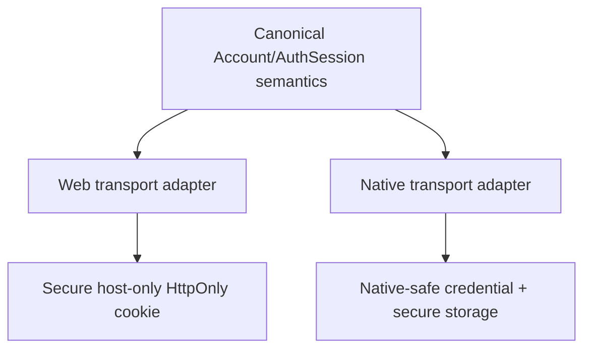

Browser cookies are not part of application/domain semantics.

Native credential transport is finalized in M6 against real platform secure-storage/runtime evidence and the already-stable AuthSession model.

---

## 9. Passkey/WebAuthn readiness

Production WebAuthn is M5, but M3 architecture must preserve these fixed principles.

### 9.1 User verification

DANTE passkey ceremonies require WebAuthn user verification. DANTE never receives/stores biometric templates, fingerprints, face data or device PINs.

### 9.2 Discoverable credentials

DANTE passkeys are designed as discoverable credentials so passkey-first/usernameless signin and future conditional UI remain possible.

### 9.3 User handle

`userHandle` is a stable random opaque 32-byte value per Account and contains no PII, email, Person ref or serialized Account ref.

### 9.4 RP ID

Use the narrowest stable canonical application security host compatible with Web and official Native association. Do not automatically choose the registrable apex merely for subdomain convenience.

### 9.5 Native association

Preserve compatibility with official platform association mechanisms:

```text
Apple associated domains / webcredentials
Android Digital Asset Links
```

### 9.6 Attestation

Mandatory consumer attestation is not selected. Normal consumer registration uses an attestation-minimizing policy; future high-security/enterprise policy may justify a separate requirement.

### 9.7 Synced/device-bound

Both are valid credentials. Backup eligibility/state are risk/security metadata, not identity or automatic trust.

### 9.8 Signature counter

Counter anomaly is a risk/security signal, not by itself unconditional login failure or account lock.

### 9.9 Challenges

WebAuthn challenges are cryptographically secure, short-lived, single-ceremony and single-use. Current direction is 32 random bytes; replay is rejected.

---

## 10. MFA compatibility

MFA implementation is deferred, but architecture remains compatible with:

```text
TOTP
authenticator-app factor
recovery codes
step-up
optional MFA
future mandatory/high-security policy
```

TOTP secret semantics, if introduced, require encrypted-at-rest key-management rather than password hashing. Recovery codes are separate random single-use secrets/proofs and are not PasswordCredential or EmailIdentity.

---

## 11. Email identity architecture

DANTE separates delivery/display representation from deterministic identity comparison.

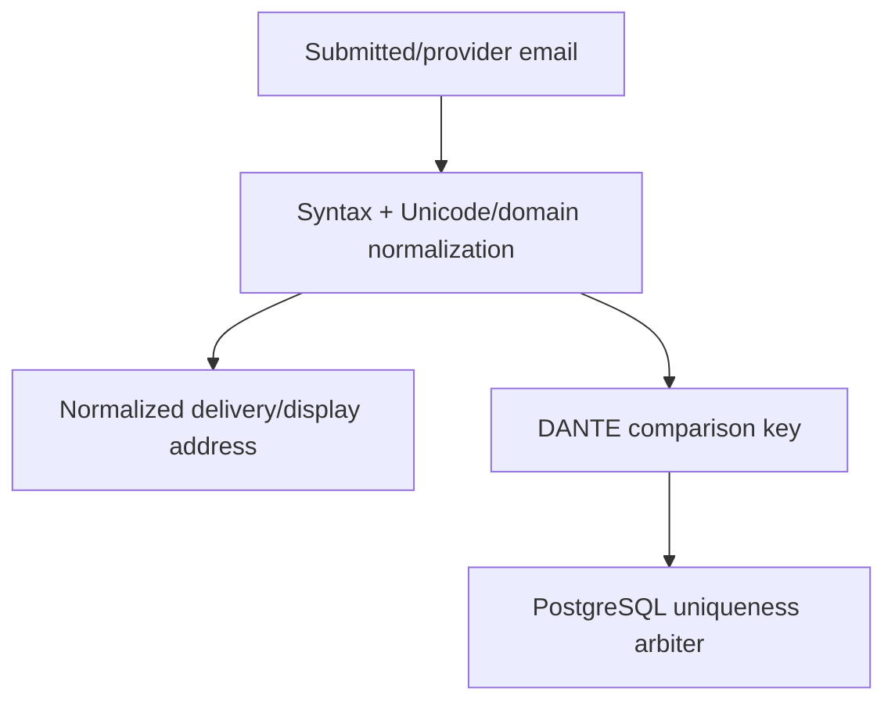

### 11.1 Comparison policy

DANTE intentionally treats login/recovery email comparison as case-insensitive even though SMTP permits rare case-sensitive local-part semantics.

```text
local part → NFC + Unicode casefold
domain     → UTS #46 / IDNA canonical ASCII lowercase
```

Display/delivery representation preserves meaningful normalized local-part form.

### 11.2 International email

The model is SMTPUTF8/EAI-ready. Actual delivery support is claimed only after the selected mail provider is proved end-to-end.

### 11.3 No provider magic

DANTE does not globally remove Gmail dots, strip plus-tags, rewrite `googlemail.com`, or embed provider-specific mailbox alias rules in canonical identity semantics.

### 11.4 Provider email

A trusted provider verified-email claim may establish verified email control for a new Account under policy when no collision exists. It never changes the federated identity key and never silently links an existing Account.

Provider email changes never silently mutate DANTE EmailIdentity.

### 11.5 Email change

Normal email change is a security-sensitive pending transition. Initial password-only policy requires valid session, recent auth, old-email confirmation, new-email confirmation, old-email notification, final uniqueness recheck, atomic switch and revocation of other sessions. If the old address is lost, use recovery rather than weakening the normal mutation.

---

## 12. Persistence and transaction doctrine

Auth inherits ADR-010/CP3/CP6 rather than creating a separate database philosophy.

```text
PostgreSQL canonical authority
one AsyncSession per application operation/task
autobegin=False
outer application operation owns transaction
persistence adapters may flush, never hidden-commit
READ COMMITTED default
narrowest truthful concurrency control
no hidden transaction retry
no blind retry after ambiguous commit
no network/human wait inside DB transaction
```

Preferred concurrency progression remains:

```text
declarative constraint
→ conditional update / expected-state compare
→ row lock with deterministic order
→ SERIALIZABLE only when a predicate invariant actually requires it
```

### 12.1 Account as security serialization point

Account-wide security mutations use the Account row as the natural serialization point when row locking is required.

Lock ordering is deterministic:

```text
Account
→ credential / identity / authenticator as needed
→ AuthSession set / specific session as needed
```

Do not use advisory locks for Account when a canonical row exists. `SKIP LOCKED` is not valid for Auth security invariants.

### 12.2 Normal authenticated request

Normal session validation is a read path and does not lock Account/AuthSession rows merely to authenticate a request.

M3 validates the current AuthSession + Account from PostgreSQL for each authentication admission. No Redis/JWT/process session cache is introduced in M3.

Principal is derived per request and not cached across requests in M3.

### 12.3 Signin transaction shape

Signin deliberately separates expensive/external work from the authoritative mutation.

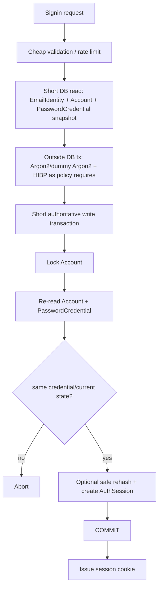

A credential that was valid at initial read is insufficient if it was replaced/reset before session creation. Final transaction revalidation is mandatory.

### 12.4 Concurrent signins

Two valid signins for the same Account are allowed to create two independent sessions. The short final security mutation may serialize on Account, but successful multi-session behavior is a feature, not a conflict.

### 12.5 Signin vs reset/disable

Whichever Account-wide mutation obtains the Account lock first establishes an order the later operation must re-evaluate against current canonical state.

Safe outcomes include:

```text
signin commits session, then reset commits and revokes it
OR
reset commits first, then stale signin credential recheck fails
```

The same principle applies to Account disable.

### 12.6 Simple current logout

Current-session logout uses the narrowest truthful mechanism: conditional terminal AuthSession revocation. It does not require Account-wide row locking.

Repeated logout/revoke is idempotent.

### 12.7 Revocation linearization

Revocation/disable commit is the security barrier.

```text
request admitted before revocation commit
→ may finish

new authentication admission after commit
→ must fail
```

DANTE does not promise distributed cancellation of requests already admitted before the barrier. Security-sensitive Account mutations additionally re-check/lock current state inside their transaction.

### 12.8 Session expiry/activity

Accepted policy:

```text
overall authentication/reauth window   30 days
inactive-session threshold             30 days
background polling resets idle         NO
server-side expiry authority           YES
```

`last_seen_at != last_user_activity_at`.

Activity persistence may be conditionally/throttled to avoid a write on every request/action, but the implementation must preserve the accepted expiry semantics and prove its bounded timing behavior.

Expired state may be derived from timestamps; AuthSession does not require a redundant mutable `EXPIRED` flag merely for convenience. Expired rows may be retained for bounded cleanup/security purposes and are not synchronously deleted on every request.

### 12.9 Ambiguous AuthSession commit

Before creating a session, generate:

```text
non-secret auth_session_ref
raw session secret
secret verifier
```

If connection loss makes COMMIT outcome ambiguous, never blind-insert a second session. When possible reconcile by the pre-generated `auth_session_ref`:

```text
exact expected row present → treat DB effect as committed
row absent → effect did not materialize
cannot reconcile → safe indeterminate service error, no cookie
```

`Set-Cookie` is emitted only after known commit or successful reconciliation.

If an HTTP response is lost after commit, the browser may or may not possess the cookie; the next bootstrap resolves actual client state. Distributed uncertainty is not fabricated away.

### 12.10 Session verifier uniqueness

The session-secret verifier is database-unique. A collision for a 256-bit random secret is treated as an RNG/security anomaly and internal failure, not normal retry noise.

### 12.11 Retry

M3 introduces no hidden/general deadlock/lock-timeout/transaction retry. A future operation-specific bounded retry requires proof that the complete application operation is safe to repeat under the DANTE idempotency/provenance constitution.

Signin does not create a persistent generic idempotency reservation merely to replay a lost HTTP response, because the raw session secret is intentionally not retained server-side.

---

## 13. OpenAPI → generated client → frontend boundary

ADR-008 already selected FastAPI OpenAPI → Orval when the first real remote product API exists. M3 is that trigger.

Canonical chain:

```mermaid
flowchart TD
    B[FastAPI routes + Pydantic API DTOs] --> O[OpenAPI 3.1]
    O --> J[Committed generated OpenAPI snapshot]
    J --> R[Orval Fetch generator]
    R --> C[@dante/api-client]
    C --> W[Web transport adapter]
    C --> N[Native transport adapter later]
    W --> A[Access application/data-source boundary]
    A --> UI[Access UI/reducer]
```

### 13.1 Authority

```text
FastAPI/Pydantic API declarations     source contract
OpenAPI snapshot                      generated + committed
Orval TypeScript/Zod                  generated + committed
```

Generated files are never hand-edited. Generated output does not become a second independent contract authority.

### 13.2 `@dante/api-client`

The package activates in M3 because real OpenAPI + first-party consumers now exist.

It is framework-neutral and transport-contract focused.

It must not own:

```text
React
TanStack Query
router/navigation
localStorage/sessionStorage
browser cookie parsing
CSRF lifecycle
Native secure storage
provider flow state
feature UI state
```

### 13.3 Orval mode

Use Orval's Fetch-oriented generated client, not Axios and not generated React/TanStack hooks.

Exact Orval version is pinned/qualified at M3 materialization using the then-current stable compatible line; M2 fixes tool family/boundary, not a forever package patch.

### 13.4 Runtime transport injection

Generated operations use an injected/runtime transport boundary.

Web adapter owns Web-specific policy:

```text
same-origin relative API path
credentials=same-origin
X-Dante-CSRF injection on applicable unsafe authenticated requests
AbortSignal propagation
safe Accept/content-type behavior
```

Native later owns native API origin/credential/secure-storage integration outside generated code.

Generated client does not automatically navigate on 401/403; application policy decides the resulting UI/session transition.

### 13.5 Base URL

Generated Web calls use relative `/api/v1/...` semantics. No PROD hostname is hardcoded into generated source.

Native transport may prepend its configured API origin while consuming the same canonical API/application semantics.

### 13.6 Response shape

Generated/client boundary retains access to status and headers needed for:

```text
RFC 9457 problem handling
X-Request-ID
Retry-After
Content-Type
```

Do not force every response into a success-only abstraction.

### 13.7 Runtime response validation

DANTE uses the already-selected Zod runtime-validation capability for the generated/normalized client boundary. TypeScript compile-time typing alone is not sufficient proof of runtime JSON shape.

Impossible/out-of-contract server payloads become a client-local `contract_violation`, not a fabricated DANTE server machine code.

Network failure before an HTTP problem response similarly becomes a client-local transport failure such as `network_unavailable`/`aborted`.

### 13.8 Wire naming

Public JSON remains wire-faithful `snake_case`. Do not introduce an implicit recursive global snake→camel transform across arbitrary payloads/problems/providers.

Application models may map explicitly to idiomatic TypeScript property names where useful.

```text
API DTO != application model != persistence mapping
```

### 13.9 OpenAPI export/drift

OpenAPI export must be deterministic and executable without live DB, external network or production secrets.

CI/regeneration path:

```text
FastAPI source
→ regenerate OpenAPI snapshot
→ compare committed artifact
→ Orval regenerate
→ compare committed generated TS/Zod
→ compile/test
```

Backend API change with stale OpenAPI, stale generated client or hand-edited generated output is a CI failure.

Generator input in CI is the local governed OpenAPI artifact, not a remote DEV/UAT URL.

---

## 14. Web remote-state/application ownership

M3 activates TanStack Query because real remote session/bootstrap/mutation state now exists. It does not replace the Access product/UI state machine.

```text
TanStack Query
→ remote request/cache lifecycle

Access reducer/application state
→ product/UI flow

canonical auth state
→ backend/PostgreSQL
```

Global session/bootstrap lifecycle is separate from one signin form reducer.

Query keys are application-owned semantic identities, not generator-derived route strings.

Auth query cache is not persisted to browser storage. Raw session cookie is HttpOnly and unavailable to JS; passwords/provider/recovery secrets never enter query persistence.

Automatic blind mutation retry is not selected for signin/logout/reauth. Safe idempotent reads such as session bootstrap may use bounded transient-error retry according to application policy.

Background session refetch/focus/reconnect does not count as user activity server-side.

---

## 15. Feature data firewall

The frontend integration path is:

```text
Access presentation
→ Access public application boundary
→ Access remote/session data source
→ @dante/api-client
→ platform transport
```

Forbidden:

```text
UI/reducer → raw fetch
UI/reducer → generated Orval file directly
feature UI → transport/cookie/CSRF internals
handwritten duplicate API DTOs/client
```

Architecture enforcement should be extended when M3 materializes the first real feature/data-source/generated-client structure, as already required by ADR-009's first-product-vertical trigger.

---

## 16. Testing authority

Detailed proof requirements live in `access-auth-testing-contract.md`.

M3 must prove, at the appropriate layers:

```text
real PostgreSQL 18.6 constraints/ACL/migrations/races
real FastAPI HTTP/problem/cookie/CSRF behavior
deterministic OpenAPI + Orval generation
Web application error/state mapping
same-origin HTTPS full-stack browser signin/bootstrap/logout
Chromium + Firefox + WebKit critical Auth spine
multi-session through separate browser contexts
secret/log redaction
```

Mocks/protocol substitutes may replace external third parties in mandatory CI, but DANTE's own Auth path may not be faked.

---

## 17. Rejected architectural shortcuts

```text
Account = Person
Account = email + password
email as Account primary key
provider email as canonical federated identity
silent provider-email account merge
generic Principal persistence without need
one universal Authenticator persistence table
one shared session token across devices
JWT/localStorage default browser auth
browser cross-origin credentialed API default
mfa_enabled as complete future policy
passkey == MFA by definition
biometric data stored by DANTE
Gmail-specific canonical identity normalization
CRUD API over Auth persistence tables
global SERIALIZABLE for Auth
Account row lock on every authenticated request
advisory lock for Account when row lock exists
SKIP LOCKED for security invariants
network/Argon2 while holding long DB transaction
blind retry after ambiguous commit
Redis/JWT session cache in M3
generic signin idempotency table without need
generated React Query hooks as API architecture
Axios added solely for generated transport
UI direct fetch/generated-client coupling
remote DEV OpenAPI as CI source
global automatic snake→camel wire conversion
```

---

## 18. M2 closure state

All cross-cutting architecture decisions required before first production Auth code are accepted:

```text
M2.1  deployment/origin topology                         CLOSED
M2.2  browser session/cookie/CSRF/CORS                  CLOSED
M2.3  Account/Identity/Credential/AuthSession/Principal CLOSED
M2.4  session/credential lifecycle/revocation           CLOSED
M2.5  password hashing + breach policy                  CLOSED
M2.6  passkey-ready + MFA compatibility                 CLOSED
M2.7  email normalization/comparison                    CLOSED
M2.8  API namespace + machine error/naming              CLOSED
M2.9  transactions/concurrency/session expiry           CLOSED
M2.10 OpenAPI/generated-client/Web boundary             CLOSED
M2.11 test matrix/full-stack harness                     CLOSED
```

No production Auth schema/API/runtime proof is claimed by M2. M3 remains the first executable slice and requires a separate exact write gate.

---

## 19. Reopen discipline

Reopen the smallest affected decision only when concrete standards, provider/platform, runtime, security or implementation evidence proves the accepted boundary cannot preserve DANTE requirements.

Framework convenience, fewer tables, another product's undocumented internals, a preference for JWT, generator fashion or a desire to reduce test scope are not sufficient reopen evidence.

---

## 20. Standards and benchmark basis

M2 was pressure-tested against current authoritative/public material including, where applicable:

- NIST SP 800-63B-4;
- OWASP Session Management, CSRF, Authentication, Password Storage and recovery guidance;
- PostgreSQL 18 transaction/locking semantics;
- RFC 9457 Problem Details;
- OpenAPI 3.1;
- W3C WebAuthn Level 3;
- Google Identity/OpenID/passkey guidance;
- Apple Sign in with Apple/passkey/native-association guidance;
- current FastAPI, Orval, TanStack Query, Vite and Playwright capabilities;
- public product behavior from OpenAI, Google, Apple, Microsoft, GitHub, Stripe, Notion, Linear and Todoist where materially comparable.

External systems are benchmark evidence, never DANTE semantic authority. Undocumented big-tech internals are not invented as justification.