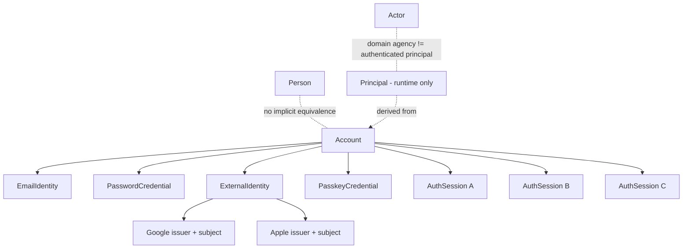
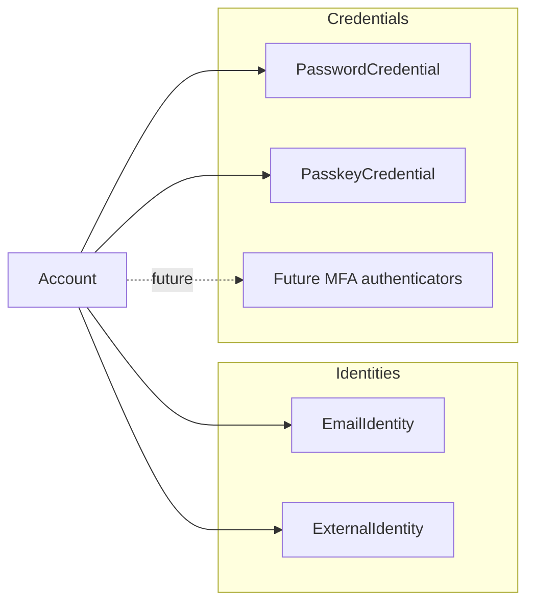
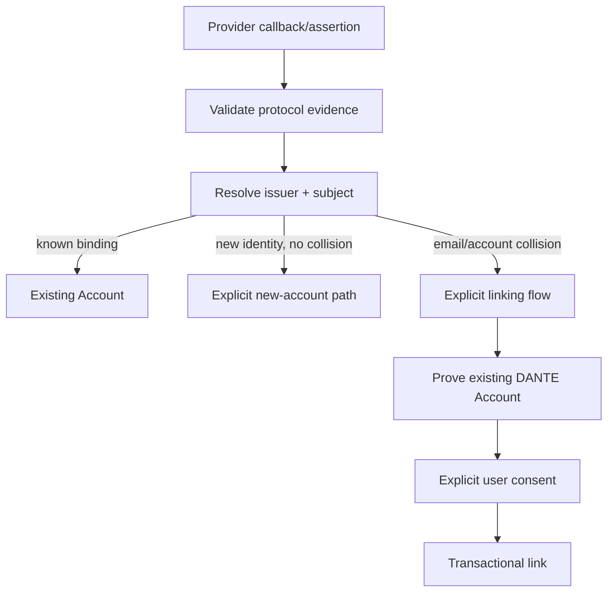
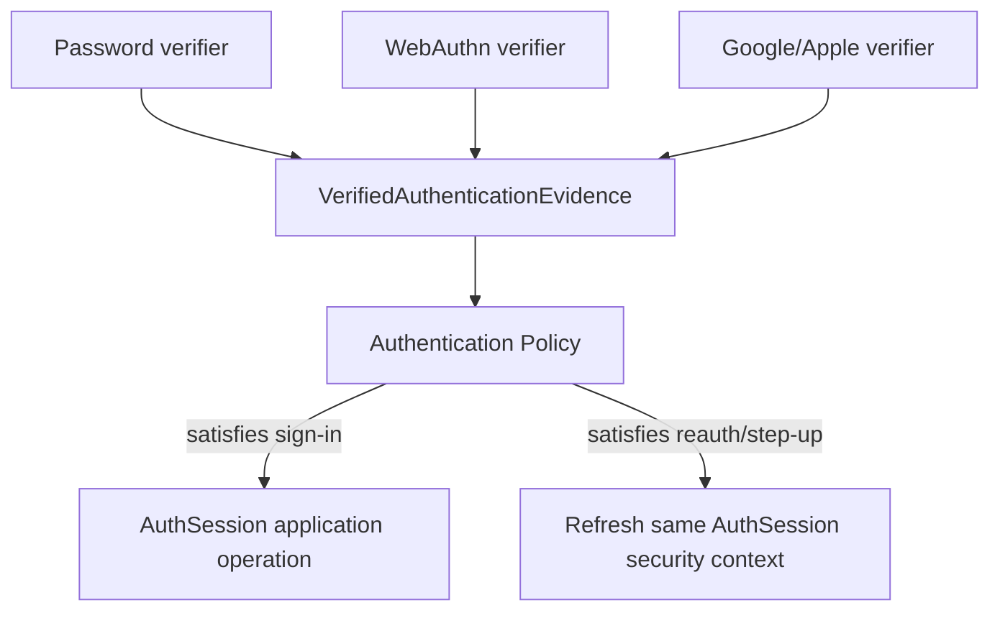
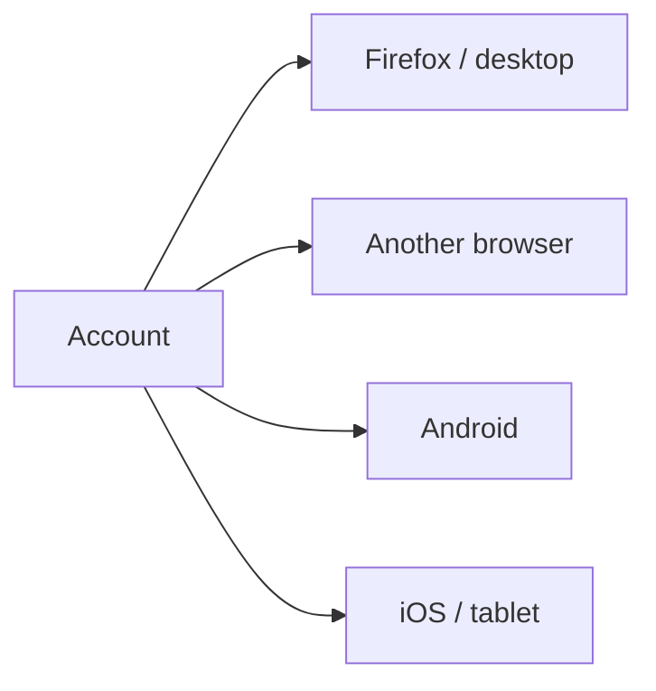
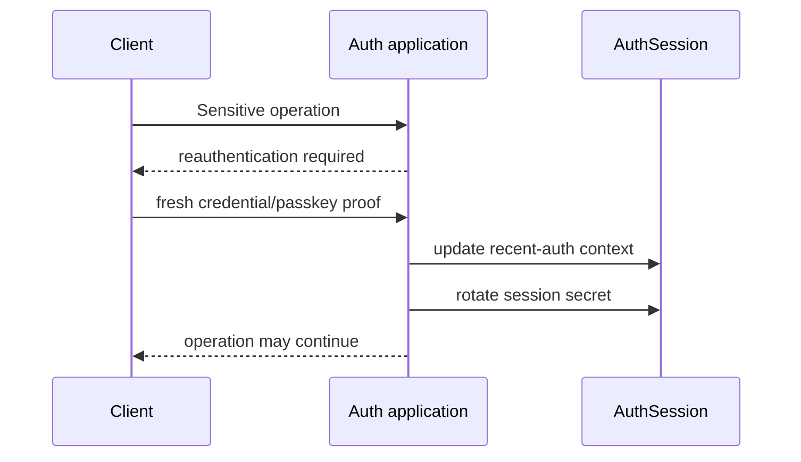
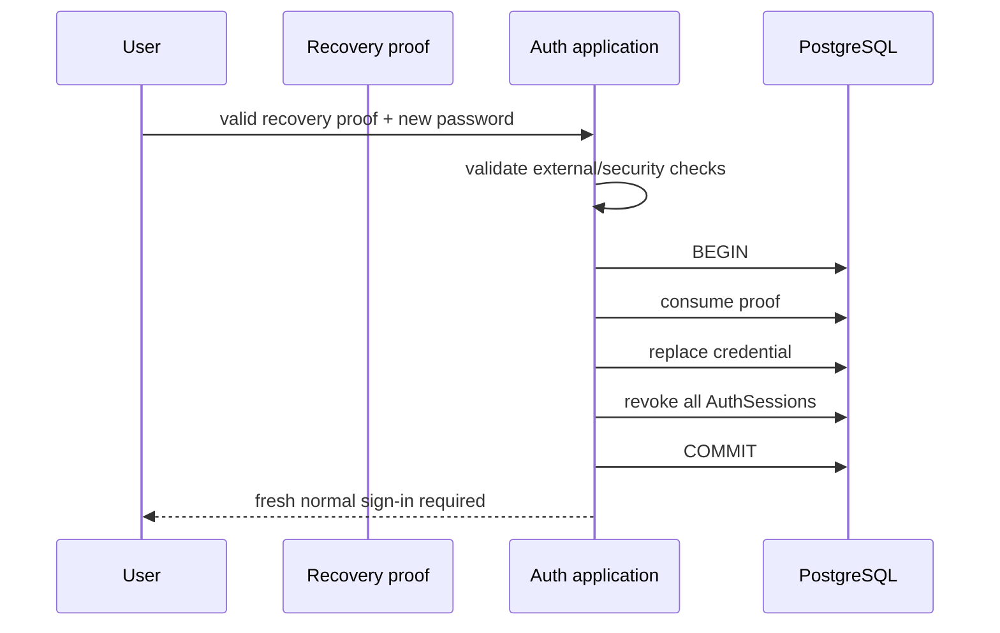
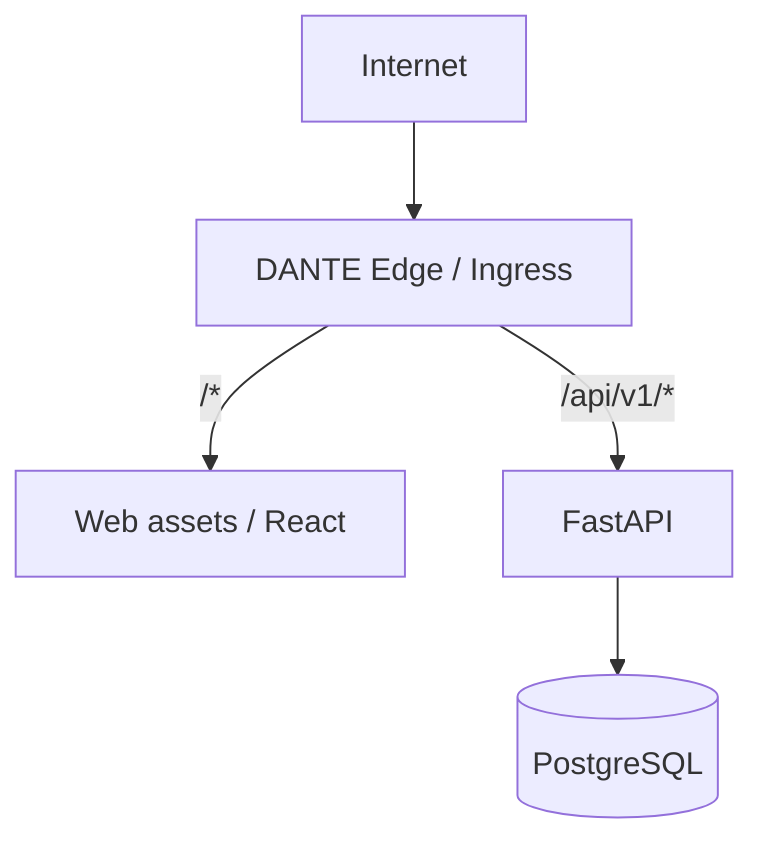
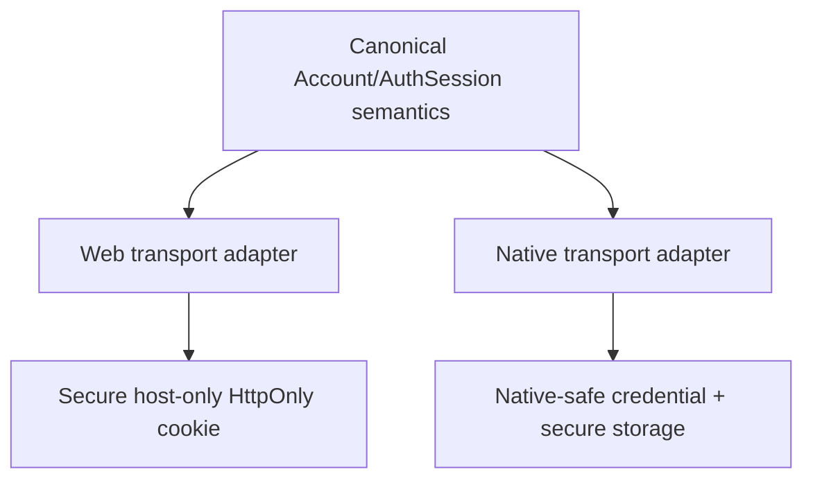
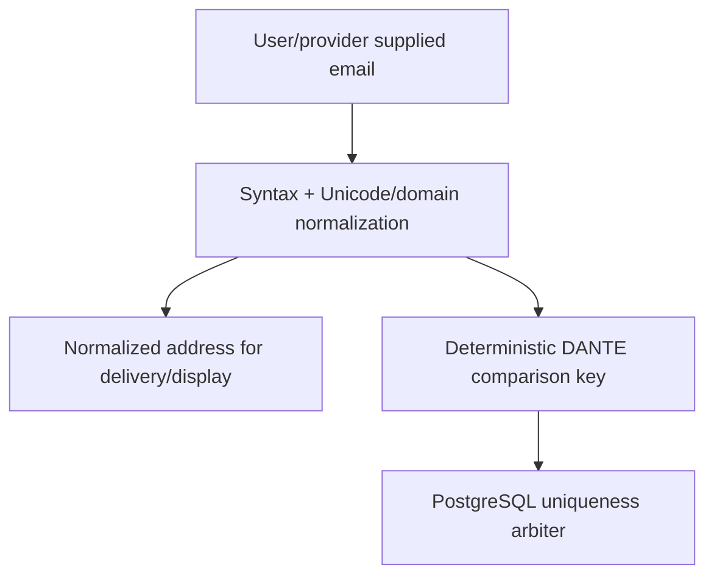

# DANTE Access/Auth Architecture Contract

- **Status:** CURRENT / BRANCH-LOCAL AUTHORITATIVE FOR ACCEPTED M2.1–M2.8 DECISIONS
- **Workstream:** `feature/access-auth`
- **Scope:** Access/Auth architecture, identity/authenticator/session boundaries, Web/Native boundary, lifecycle semantics and passkey/MFA readiness
- **Does not authorize:** production Auth schema, migrations, endpoints, generated clients or provider integrations before M2 closes

This document states the current Access/Auth architecture directly. It is organized by subject rather than by the chronology of M2 discussions. The active workstream record remains the operational save-game; this file owns the durable architectural meaning of decisions already accepted in M2.1–M2.8.

The implementation must also preserve all stronger current DANTE authorities, especially Domain/Logical/Physical invariants, ADR-007, ADR-010, the PostgreSQL persistence constitution, current frontend architecture boundaries and the Access frontend contract.

---

## 1. Architectural objective

DANTE Access/Auth must support a consumer-grade authenticated product across Web and Native without collapsing authentication into the Domain model or binding the application to one credential type.

The architecture must support, without semantic rewrite:

- password authentication;
- Google and Apple authentication;
- passkeys / WebAuthn;
- concurrent Web and Native sessions;
- reauthentication and sensitive-operation step-up;
- future optional MFA/TOTP/recovery-code capabilities;
- future account/session management and security UX.

The core non-collapse rules are:

```text
Person != Account != Principal != Actor
AuthSession != DANTE Session
signin != provider-data integration authorization
provider identity != provider email
client/device signal != identity
frontend request/success != backend-authoritative success
```

---

## 2. Canonical conceptual model

`Account` is the durable Access/security root. It is not a profile, a Person, a runtime Principal, a global role holder or an email/password record.



Conceptual names in this document are not pre-approved PostgreSQL table names. Concrete persistence appears only when a vertical slice justifies exact semantics.

### 2.1 Account

`Account` owns durable access/security lifecycle state.

It must not directly contain or imply:

```text
password hash
email as primary key
Google/Apple subject
passkey payload
session secret
Person profile fields
global workspace role
device identity
```

Initial lifecycle must distinguish at least an account that is usable from one that is disabled. Email verification, setup completion, password presence and account availability remain separate facts.

### 2.2 Person

`Person` remains the DANTE Domain/native human identity concept. Access/Auth must not retrofit login or password semantics into `Person`.

No Account↔Person 1:1 relation is inferred merely because a consumer user is normally a human. If the product later needs a relationship between an authenticated Account and a Person, that relation requires explicit semantics and its own justification.

### 2.3 Principal

`Principal` is the runtime authenticated security context derived for a request from Account/AuthSession and applicable authorization context.

A durable Principal table is **not selected**.

Conceptually:

```text
Principal
├── account_ref
├── auth_session_ref
├── authenticated/recent-auth context
├── verified authentication properties
└── request-scoped authorization context
```

### 2.4 Actor

`Actor` remains a Domain agency concept. Authentication does not imply that `Principal == Actor`.

---

## 3. Identity and credential decomposition

DANTE does not model `Account = email + password`.



### 3.1 EmailIdentity

Email is a separately governed identity/contact/recovery concept, not the Account identifier itself.

Current consumer product invariant:

```text
standard consumer Account
→ maintains at least one verified recovery/contact EmailIdentity
```

An Account may authenticate without a password while still maintaining a verified EmailIdentity for recovery/contact purposes.

### 3.2 PasswordCredential

Password is optional:

```text
Account → 0..1 current PasswordCredential
```

No architecture may assume `account.password_hash` exists.

Password history is not a default model. Periodic forced password change is not selected without a concrete security reason.

### 3.3 ExternalIdentity

Google/Apple identity binding uses protocol-valid stable identity:

```text
issuer + subject
```

Provider email is an attribute/evidence input, never the canonical federated identity key.

Email coincidence must never silently merge or link Accounts.



### 3.4 PasskeyCredential

An Account may have zero or many passkeys:

```text
Account → 0..N PasskeyCredential
```

Passwordless Account configurations are valid.

Passkey is not synonymous with MFA. It may be a primary sign-in authenticator or participate in future step-up/MFA policy depending on the verified ceremony properties.

---

## 4. Authentication evidence and policy boundary

Authenticator-specific code verifies evidence. It does **not** own session creation.



This prevents separate session architectures for password, provider and passkey flows.

Conceptually, verified authentication evidence can expose properties such as:

```text
account
method
verified_at
user verification performed?
phishing resistant?
factor capabilities
protocol-specific trusted properties
```

These are application/security concepts, not a requirement for a generic polymorphic database table.

### 4.1 Method, factor and assurance are different

```text
Authentication Method != Authentication Factor != Authentication Assurance
```

DANTE must not use a permanent `mfa_enabled` boolean as the core security model.

Future policy evaluates the authenticators and evidence actually available for an Account and session.

### 4.2 No unearned NIST AAL labels

NIST authentication guidance is an engineering benchmark. DANTE must not label a session `AAL2` or similar unless the complete applicable requirements are genuinely implemented and proved.

Store/evaluate concrete security properties rather than borrowed compliance labels.

---

## 5. AuthSession model

DANTE supports multiple independent sessions per Account.



Each AuthSession has its own secret, expiry and revocation lifecycle.

Required conceptual capabilities include:

- stable non-secret AuthSession identifier;
- independent session secret/verifier;
- created/authenticated/recent-auth timestamps as justified;
- authoritative expiry;
- user-activity tracking distinct from background polling;
- independent revocation;
- safe client/session metadata for future session-management UX;
- security method/evidence history sufficient for current policy without turning the session row into an audit log.

Raw session secrets never become durable server-side state.

### 5.1 Session actions

The product distinguishes:

```text
LOG OUT
→ revoke current AuthSession

REVOKE SESSION X
→ revoke only X

REVOKE ALL OTHER SESSIONS
→ current survives

LOG OUT EVERYWHERE
→ revoke all, including current
```

These are separate application intents.

### 5.2 Reauthentication

Reauthentication does not create a second AuthSession.



Recent-auth must remain policy/assurance-aware. A timestamp alone must not become the permanent abstraction.

---

## 6. Account/session security lifecycle

### 6.1 Normal logout

```text
current AuthSession → revoked
cookie/native credential → cleared/invalid
operation → idempotent
```

### 6.2 Authenticated password change

Requires recent authentication.

```text
replace PasswordCredential
+ revoke all other AuthSessions
+ retain initiating AuthSession when policy permits
+ rotate initiating session secret
```

### 6.3 Password recovery/reset

Recovery is a stronger security event than normal credential maintenance.



No automatic authenticated session is created after recovery reset.

### 6.4 Account disable

Account disable atomically makes the Account unavailable and revokes all active AuthSessions.

Re-enabling an Account never resurrects old sessions.

### 6.5 Authenticator add/remove

Adding security-sensitive authenticators requires recent authentication and creates a security event/notification capability.

Removing an authenticator requires proof through a method that remains valid after removal where applicable and may not leave the Account with no usable access/recovery path.

Normal maintenance and declared compromise are distinct flows:

```text
normal removal
→ invalidate selected authenticator
→ rotate current session as required
→ do not blanket-revoke every session without reason

compromise flow
→ invalidate compromised authenticator
→ revoke affected/other sessions according to policy
→ rotate secured current session after strong proof
```

---

## 7. Web deployment boundary

The normal browser boundary is same-origin even when Web and FastAPI are physically/deployment independent.



Canonical browser-facing shape:

```text
https://<canonical-app-origin>/
https://<canonical-app-origin>/api/v1/*
```

The edge hides physical service topology from the normal browser security model.

Browser direct cross-origin API access is not the default. CORS is therefore disabled/no ACAO by default for the normal Web path.

A future dedicated native/public API hostname remains possible without changing Account/AuthSession semantics.

### 7.1 Local development

The browser should still see a same-origin model through a development reverse proxy:

```text
localhost Web origin
/api/* → local FastAPI
```

Do not introduce broad development CORS merely because frontend/backend processes use different local ports internally.

### 7.2 Proxy trust

Security-sensitive forwarded headers may only be trusted from the explicitly trusted edge/proxy boundary. FastAPI must not blindly trust Internet-supplied `X-Forwarded-*` headers.

---

## 8. Web vs Native transport

Session semantics are canonical; credential transport is client-specific.



Browser cookies are not part of the application/domain contract.

Native credential transport is intentionally finalized in M6 when platform runtime and secure-storage behavior are implemented. It must reuse canonical Account/AuthSession semantics rather than creating a second auth backend.

---

## 9. Passkey/WebAuthn readiness

The following principles are already fixed even though production WebAuthn is implemented in M5.

### 9.1 User verification

DANTE passkey ceremonies require WebAuthn user verification.

DANTE never receives or stores biometric templates, Face ID data, fingerprints or device PINs. The authenticator performs local user verification and reports the verified ceremony property.

### 9.2 Discoverable credentials

DANTE passkeys are designed as discoverable credentials so usernameless/passkey-first sign-in and future conditional UI remain possible.

### 9.3 User handle

WebAuthn `userHandle` is a stable random opaque 32-byte identifier per Account.

It must not contain:

```text
email
username
Person ref
serialized Account ref
other PII
```

### 9.4 RP ID

The WebAuthn RP ID must use the narrowest stable canonical application security host compatible with Web and Native platform association. Do not automatically choose the registrable apex merely to grant every future subdomain credential authority.

The concrete production hostname is infrastructure-time configuration, but the security principle is fixed.

### 9.5 Native association

Native clients must be able to share the same RP/backend account semantics through official platform association mechanisms, including:

- Apple associated domains / `webcredentials`;
- Android Digital Asset Links.

### 9.6 Attestation

Mandatory consumer attestation is not selected. Normal consumer passkey registration uses an attestation-minimizing posture (`none` direction) to avoid unnecessary privacy/vendor coupling.

Future high-security/enterprise policy may introduce a separately justified attestation requirement.

### 9.7 Synced and device-bound credentials

Both synced and device-bound passkeys are valid DANTE credentials.

Backup eligibility/state may be retained as risk/security metadata when materialized, but it is not identity and does not automatically determine trust.

### 9.8 Signature counter

A WebAuthn signature-counter anomaly is a security/risk signal, not by itself an unconditional login failure or Account lock.

### 9.9 Challenges

WebAuthn challenges are cryptographically secure, single-ceremony, short-lived and single-use. Current direction is 32 random bytes. Replay is rejected.

---

## 10. MFA compatibility boundary

MFA implementation is deferred, but the architecture must support later:

```text
TOTP authenticator
recovery codes
step-up policy
optional MFA
future mandatory policy for selected accounts/roles
future high-security account profile
```

No current model may assume that password is always present or that one Boolean describes all future security posture.

TOTP secrets, if later introduced, require encrypted-at-rest key-management semantics rather than password hashing. Recovery codes are separate strong random single-use credentials/proofs and must not be collapsed into PasswordCredential or EmailIdentity.

---

## 11. Email identity architecture

DANTE separates the address used for delivery/display from the deterministic comparison representation used for identity lookup and uniqueness.



### 11.1 Comparison policy

DANTE intentionally treats email identity comparison as case-insensitive even though SMTP technically permits case-sensitive local parts.

Conceptual policy:

```text
local part  → NFC + Unicode casefold

domain      → UTS #46 / IDNA canonical ASCII lowercase
```

The normalized delivery/display address preserves the meaningful local-part form rather than forcing the UI to display the comparison key.

### 11.2 International email

The model is SMTPUTF8/EAI-ready and must not assume an ASCII-only local part. Production delivery support must nevertheless be proved end-to-end with the selected mail provider before claiming the feature supported.

### 11.3 No provider-specific magic

DANTE does not globally:

```text
remove Gmail dots
strip +tags
rewrite googlemail.com
apply provider-specific mailbox aliases
```

Such behavior is not a general email-identity rule and can be incorrect even within one provider ecosystem.

### 11.4 Provider email

A trusted provider's verified email claim may establish verified email control for a new Account under explicit policy if there is no collision. It never changes the federated identity key and never silently links an existing Account.

Provider email change never silently mutates canonical DANTE EmailIdentity.

### 11.5 Email change

Normal email change is a security-sensitive pending transition, not an in-place update on first request.

Initial password-only policy requires:

- valid AuthSession;
- recent authentication;
- confirmation of the old email;
- confirmation of the new email;
- notification of the old email;
- re-check of new comparison-key availability;
- atomic final switch;
- revocation of other sessions;
- initiating session may survive only when its security continuity remains valid and its secret is rotated.

If control of the old address is lost, use account recovery rather than weakening normal email-change semantics.

---

## 12. Persistence and concurrency doctrine

Access/Auth does not create its own database philosophy.

It inherits ADR-010 and the PostgreSQL persistence constitution:

```text
PostgreSQL canonical authority
one AsyncSession per application operation/task
autobegin=False
outer application operation owns transaction
persistence adapters may flush, not hidden-commit
READ COMMITTED default
constraint/locking escalation only for concrete invariant
no blind retry of non-idempotent security mutations
no long transaction around external network work
```

Account-wide security mutations use the Account as the natural serialization point when row locking is required to establish an unambiguous order between security-sensitive operations.

Expensive crypto and external protocol/network validation should happen outside long DB transactions, followed by authoritative revalidation under the transaction before mutation.

Proof consumption + credential mutation + required session revocation must be atomic when the lifecycle requires all-or-nothing semantics.

---

## 13. Rejected architectural shortcuts

The accepted M2.1–M2.8 architecture rejects the following as defaults:

```text
Account = Person
Account = email + password
email as Account primary key
provider email as canonical federated identity
silent provider-email account merge
generic Principal persistence without need
one universal Authenticator persistence table
one shared session token across devices
JWT/localStorage as default browser auth
browser cross-origin credentialed API as default
mfa_enabled Boolean as complete future policy
passkey == MFA by definition
biometric data stored by DANTE
Gmail-specific normalization in canonical email identity
CRUD API over Auth persistence tables
```

---

## 14. Current implementation boundary

Accepted architecture does not imply materialized persistence or runtime behavior yet.

As of this checkpoint:

```text
M2.1–M2.8 architecture decisions      ACCEPTED
M2.9 transaction/concurrency closure  OPEN
M2.10 generated-client boundary       OPEN
M2.11 M3 test matrix/harness          OPEN
production Auth schema/API            NOT STARTED
```

M3 production implementation starts only after M2 closes and a separate exact write gate is approved.

---

## 15. Reopen discipline

Reopen the smallest affected Access/Auth decision only when concrete implementation, security, provider/platform or standards evidence proves the accepted boundary cannot preserve DANTE requirements.

Framework convenience, fewer tables, a preference for JWT, ORM ergonomics, a provider-specific shortcut or a desire to mirror another product's implementation are not reopen evidence.

---

## 16. Standards and benchmark references

The architecture was cross-checked against current public guidance and product behavior including:

- NIST SP 800-63B-4 — authentication/session/authenticator lifecycle guidance;
- OWASP Session Management, CSRF Prevention, Password Storage and Forgot Password guidance;
- W3C WebAuthn Level 3;
- Google Identity / passkey / OpenID Connect guidance;
- Apple Sign in with Apple / passkey platform guidance;
- current public account/session/passkey behavior documented by OpenAI, Notion, Linear and Todoist where materially comparable.

External products are benchmark evidence, not DANTE authority. DANTE keeps the stricter semantic boundary when a public product convention would weaken canonical identity, security or Domain separation.