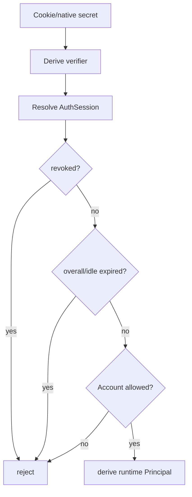
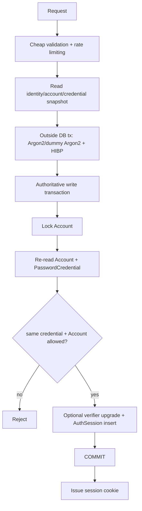

# DANTE Access/Auth Security Contract

- **Status:** CURRENT / BRANCH-LOCAL AUTHORITATIVE / M2 CLOSED
- **Workstream:** `feature/access-auth`
- **Scope:** session security, CSRF/CORS, password and email security, provider/passkey readiness, transaction ordering, expiry/revocation, logging and security-response behavior accepted in M2.1–M2.11
- **Does not authorize:** production Auth implementation outside the separately gated M3 slice

This is the durable Access/Auth security contract. It complements the architecture, API and testing contracts and inherits the DANTE PostgreSQL persistence constitution rather than defining a competing persistence/security model.

---

## 1. Security objectives

Access/Auth must resist at least:

```text
credential theft / stuffing / brute force
session theft / fixation / replay
CSRF
account enumeration
provider-account takeover through email coincidence
recovery-token replay
password reset/session races
credential-change/session races
session-create/revoke races
passkey ceremony replay
unsafe account/session revocation behavior
secret leakage through logs/URLs/client storage
unbounded KDF/resource exhaustion
ambiguous-commit duplication
stale-authentication races
```

Security controls must preserve consumer-grade UX and legitimate multi-device use. Security theater that adds complexity without reducing a real threat is not selected.

---

## 2. Browser session transport

The normal Web boundary uses a server-authoritative opaque session.

### 2.1 Session secret

On successful signin:

```text
CSPRNG 256-bit opaque secret
        │
        ├────────────► browser secure cookie
        │
        ▼
SHA-256(secret)
        │
        ▼
indexed AuthSession verifier in PostgreSQL
```

The raw secret is never stored in PostgreSQL or application logs.

SHA-256 is appropriate for the verifier because the token is high-entropy random material, not a human password.

A stable non-secret AuthSession reference remains separate from the secret/verifier for observability, reconciliation and future session-management UX.

### 2.2 Web cookie

Production direction:

```http
Set-Cookie: __Host-dante-session=<opaque-secret>; Secure; HttpOnly; Path=/; SameSite=Lax; Max-Age=2592000
```

Rules:

```text
Secure               required in production
HttpOnly             required
Path                  /
Domain                absent
host-only             yes
SameSite              Lax
JavaScript access     no
localStorage token    forbidden
sessionStorage token  forbidden
IndexedDB auth token  forbidden
token in URL          forbidden
```

The `__Host-` prefix is selected to enforce host-only `/` semantics in compliant browsers.

`SameSite=Lax` is defense-in-depth, not the sole CSRF defense. Provider-specific callback requirements must not weaken the main session cookie to `SameSite=None` globally.

### 2.3 Cookie issuance authority

The browser session cookie is emitted only after the canonical AuthSession transaction is known committed or successfully reconciled after an ambiguous commit.

Never:

```text
Set-Cookie first
→ hope PostgreSQL commits later
```

---

## 3. Session lifetime and activity

Accepted policy:

```text
overall authentication/reauthentication window  30 days
inactive-session threshold                      30 days
background polling counts as user activity      NO
server-side expiry authority                    YES
cookie Max-Age                                  <= authoritative maximum
```

Successful reauthentication refreshes the applicable authentication/session window and rotates the session secret.

`last_seen_at != last_user_activity_at`.

Background bootstrap/refetch/polling must not indefinitely keep an abandoned session alive.

Activity persistence may be conditionally/throttled to avoid write amplification. The implementation must prove that the throttle preserves the stated policy and does not create an undocumented large grace/early-expiry interval.

Session durations are configurable policy, not hardcoded schema meaning. Future high-security/enterprise policy may use shorter windows without changing AuthSession semantics.

---

## 4. Session validation

Every authenticated request derives authority from current server-side state.



M3 consults PostgreSQL for session authentication admission. No Redis/JWT/process session cache is introduced in M3.

Normal session validation is a read path; it does not acquire Account row locks merely to authenticate a request.

Principal is request-scoped and not cached across requests in M3.

---

## 5. Revocation linearization

A revocation/disable transaction COMMIT is the security barrier.

```text
request admitted before revocation commit
→ may finish

new authentication admission after revocation commit
→ must fail
```

DANTE does not claim distributed cancellation of work already admitted before the barrier.

Security-sensitive Account-wide mutations additionally lock/re-check current Account/security state inside their transaction so they cannot complete on stale assumptions.

---

## 6. CSRF contract

Authenticated browser mutations use layered CSRF defense.

For state-changing POST/PUT/PATCH/DELETE operations:

```text
expected content type
+ exact trusted Origin
+ Fetch Metadata
+ session-bound synchronizer token
+ valid AuthSession
```

No state-changing GET.

### 6.1 Synchronizer token

DANTE is stateful, so a session-bound synchronizer token is preferred over naive double-submit.

Application contract direction:

```text
GET /api/v1/auth/session
→ may return CSRF token for authenticated Web bootstrap

Web application
→ keeps token in process memory only

unsafe authenticated mutation
→ X-Dante-CSRF: <token>
```

Token must be unpredictable, session-bound, securely compared, absent from URLs and redacted from logs.

Concrete storage/derivation is decided in the slice that materializes AuthSession.

### 6.2 Origin and Fetch Metadata

Unsafe browser requests require exact expected-origin behavior.

Normal accepted posture:

```text
Sec-Fetch-Site: same-origin
```

A sibling subdomain is not automatically trusted merely because it is `same-site`.

Cross-site unsafe requests are rejected. Missing reliable browser origin signals fail closed unless an explicitly reviewed protocol exception exists.

Referer may be a bounded fallback when required by browser behavior; ambiguous origin is not accepted for convenience.

### 6.3 Login CSRF

Pre-auth signin cannot rely on AuthSession CSRF state.

Normal email/password signin requires:

```text
application/json
+ exact same-origin Origin
+ Fetch Metadata
+ required DANTE application/custom request header contract
```

Provider authentication separately uses protocol state/nonce/PKCE as applicable.

---

## 7. CORS and origin posture

Normal browser ingress is same-origin:

```text
CORS = disabled / no Access-Control-Allow-Origin by default
```

Never use broad credentialed wildcard/regex policies as the default.

If another browser origin becomes a real requirement, it receives explicit exact allow-listing and threat review.

CORS is a browser control and is not the security model for Native clients.

---

## 8. Session fixation, rotation and reauthentication

Anonymous/pre-auth state is never promoted into an authenticated AuthSession.

Successful signin always creates a fresh AuthSession and fresh secret.

Successful reauthentication:

```text
same AuthSession identity
+ refresh recent-auth/security context
+ refresh applicable session window
+ rotate session secret
+ invalidate old secret
```

Rotation also applies to meaningful security-context changes where retaining the same bearer secret would unnecessarily preserve stolen-token usefulness.

DANTE does not rotate arbitrarily every few minutes where it creates races without meaningful security value.

---

## 9. Session actions

### 9.1 Current logout

```text
conditional terminal revoke of current AuthSession
+ clear browser/native credential
+ idempotent result
```

Repeated logout/revoke must not cause corruption or 500-class failure.

Current logout does not require Account-wide row locking.

### 9.2 Remote actions

DANTE distinguishes:

```text
revoke specific session
revoke all other sessions
log out everywhere
```

Remote/session-wide settings actions require recent authentication except current logout, which must remain available.

### 9.3 Account disable

Account disable atomically:

```text
marks Account unavailable
+ revokes all AuthSessions
```

All authentication methods are denied while disabled. Re-enable never resurrects old sessions.

---

## 10. Password product policy

Accepted rules:

```text
minimum                         15 Unicode code points
maximum                         1024 Unicode code points
maximum normalized UTF-8       4096 bytes
support >=64 characters        required
Unicode                         supported
normalization                   NFC
mandatory composition           none
paste/password manager          allowed / first-class
show/hide                       allowed
silent truncation               forbidden
trim/casefold                   forbidden
periodic forced change          not selected without security reason
```

Password is an exact secret. DANTE does not lowercase, trim, collapse spaces or truncate it silently.

Composition-rule checklists are not selected; breach/common-password intelligence is the stronger server-side quality authority.

---

## 11. Password storage

### 11.1 Argon2id

Selected policy:

```text
algorithm       Argon2id
Argon2 version  19
memory          65536 KiB / 64 MiB
iterations      3
parallelism     4
hash length     32 bytes
salt length     16 random bytes
```

Current library direction is maintained `argon2-cffi` compatible with DANTE Python. Exact version is admitted/pinned only after normal dependency/runtime proof.

Parameters are explicit DANTE policy, not implicit mutable library defaults.

### 11.2 Pepper

Selected construction:

```text
NFC UTF-8 password
      │
      ▼
HMAC-SHA-256
key = random 256-bit DANTE password pepper
      │
      ▼
32-byte prehash
      │
      ▼
Argon2id
```

Pepper never lives with the verifier in PostgreSQL or Git. Production pepper belongs to deployment secret management; LOCAL uses non-committed local secret material.

A non-secret key/version identifier may support planned rotation.

Actual pepper compromise requires incident/reset policy; opportunistic rehash is not sufficient remediation.

### 11.3 Rehash on authentication

After successful password verification, policy checks whether stored verifier requires upgrade.

Expensive verification/rehash occurs outside the authoritative mutation transaction where practical. Before updating a verifier or creating a session, the application locks/re-reads canonical state and proves the current PasswordCredential is the one actually verified.

If reset/change replaced it concurrently, stale authentication aborts.

---

## 12. Password breach screening

Initial adapter: HIBP Pwned Passwords range API using k-anonymity.

```text
password
→ local SHA-1 only for HIBP protocol
→ send first 5 hexadecimal characters
→ receive candidate suffixes
→ compare locally
```

The raw password/full SHA-1/email is never sent. Request padding is enabled where supported.

SHA-1 is protocol-only here, never password storage.

### 12.1 Establishing credentials

Required on signup/set password, authenticated password change and recovery reset.

Any known breach count >0 rejects the proposed password.

If HIBP is unavailable while establishing a new PasswordCredential:

```text
fail closed
→ retryable dependency/security failure
```

### 12.2 Existing signin

On successful existing-password authentication, DANTE may re-check current breach intelligence.

If current intelligence marks it compromised:

```text
no new AuthSession
→ require password reset/change according to compromise policy
```

If HIBP itself is temporarily unavailable:

```text
valid existing credential
→ fail open for auxiliary breach intelligence
→ security telemetry
```

This prevents a third-party outage from becoming a global login outage while remaining strict when establishing new credentials.

---

## 13. KDF resource-abuse controls

Argon2 must not block the FastAPI event loop or become an unbounded memory-amplification primitive.

Required runtime posture:

```text
cheap validation + rate limit first
→ bounded password-KDF worker capacity
→ Argon2 verification/hash
```

Unlimited ThreadPoolExecutor-style KDF concurrency is not selected.

Exact concurrency limits are benchmarked against target resources before production closure.

Unknown-account signin performs dummy Argon2 verification using current policy to reduce obvious known-vs-unknown timing differences; rate limiting still precedes expensive KDF work.

---

## 14. Signin transaction/security ordering

Signin uses a short-read / expensive-work / short-authoritative-write shape.



Do not hold an Account lock/database transaction during Argon2 or HIBP network work.

### 14.1 Account serialization point

For account-wide security mutations, Account row locking establishes a canonical order.

Lock order:

```text
Account
→ relevant credential/identity/authenticator
→ relevant AuthSession set/session
```

Use ordinary row locks because Account is a natural canonical row. Do not introduce advisory locking for this invariant.

Do not use `SKIP LOCKED` for security invariants.

### 14.2 Concurrent signins

Two valid concurrent signins are allowed and produce independent sessions. The short final mutations may serialize on Account but one legitimate client must not overwrite the other.

### 14.3 Signin vs reset/disable

Both safe orderings are valid:

```text
signin commits first
→ reset/disable later revokes/prevents resulting session

reset/disable commits first
→ stale credential/account recheck makes signin fail
```

The system must never create a post-reset session from an obsolete verified password.

---

## 15. Ambiguous commit handling

A timeout/disconnect does not prove rollback.

Before AuthSession insert, generate:

```text
auth_session_ref
raw secret
secret verifier
```

If COMMIT outcome is ambiguous, do not blindly retry and create another session.

When connectivity returns, reconcile by the generated non-secret `auth_session_ref`:

```text
expected row exists
→ effect committed

row absent
→ effect did not materialize

cannot reconcile
→ safe indeterminate service error
→ no cookie issued
```

An orphan committed session whose raw secret was never delivered does not give the client authority and expires/cleans up normally.

The raw secret is never persisted merely to enable generic idempotent replay.

---

## 16. Retry contract

No hidden SQLAlchemy/driver/general transaction retry.

DANTE does not automatically retry signin/logout/reauth/security mutations based solely on exception class or `retryable=true`.

Operation-specific bounded deadlock/serialization retry may be introduced later only when the full application operation is proven safe to repeat under DANTE idempotency/provenance rules.

Logout is naturally idempotent and may be safely repeated after a lost response.

---

## 17. Password change and recovery

### 17.1 Authenticated password change

Requires valid session + recent authentication.

Atomic security effect:

```text
replace PasswordCredential
+ revoke all other AuthSessions
+ retain initiating session only if continuity remains valid
+ rotate initiating session secret
+ security event/notification capability
```

Replacing the current password with the exact current password is rejected. Persistent password-history table is not selected.

### 17.2 Recovery reset

Atomic effect:

```text
consume valid recovery proof
+ replace PasswordCredential
+ revoke all existing AuthSessions
```

No automatic authenticated session follows. User performs fresh normal signin.

---

## 18. Email security

### 18.1 Identity comparison

Conceptual comparison key:

```text
local part → NFC + Unicode casefold
domain     → UTS #46 / IDNA canonical ASCII lowercase
```

Display/delivery form remains separate. PostgreSQL is final uniqueness arbiter.

`citext` alone is not selected as canonicalization because it does not define the complete Unicode/IDNA/product policy.

### 18.2 Provider-specific rewriting

DANTE does not canonicalize Gmail dots, strip plus tags, rewrite provider domains or otherwise embed provider-specific alias rules in core identity comparison.

Abuse controls solve abuse; normalization does not invent false mailbox equivalence.

### 18.3 Verification

`verified_at` proves control of that exact EmailIdentity. It does not transfer automatically to a replacement address.

Verification/recovery proofs require strong random generation, bounded expiry, single use, replay resistance, race-safe consume, anti-enumeration where required and verifier/digest storage where practical.

### 18.4 Email change

Initial password-only normal change requires:

```text
valid session
+ recent auth
+ old-email confirmation
+ new-email confirmation
+ old-email notification
+ pending transition
+ final uniqueness recheck
+ atomic switch
+ revoke other sessions
```

If the old address is unavailable, use recovery rather than weakening the normal mutation.

The old address does not silently remain an active login/recovery alias.

---

## 19. Provider security

Provider authentication and provider-data integration are separate boundaries.

Authentication validates protocol-required evidence including as applicable:

```text
state
nonce
PKCE
issuer
audience
signature
subject
callback/transaction replay state
```

External identity key:

```text
issuer + subject
```

Provider email never silently links Accounts.

Provider auth access/refresh tokens are not retained unless authentication itself has a reviewed bounded requirement. Gmail/Calendar/iCloud integration tokens never leak into the Auth model by convenience.

---

## 20. Passkey/WebAuthn security

Production implementation occurs in M5; earlier code must remain compatible.

### 20.1 Ceremony

```text
userVerification = required
user presence     required
challenge         32-byte CSPRNG direction
challenge expiry  bounded
challenge use     single ceremony / single use
origin check      required
RP ID check       required
credential check  required
signature check   required
replay            rejected
```

### 20.2 Privacy

DANTE never stores biometric templates, fingerprints, face data or device PINs.

Mandatory consumer attestation is not selected; normal consumer policy minimizes attestation/privacy coupling.

### 20.3 Credential properties

Synced and device-bound passkeys are supported. Backup eligibility/state are metadata/risk signals, not identity or automatic trust.

Signature-counter anomaly is a risk signal; non-increasing counter alone is not unconditional Account lock/failure.

---

## 21. Future MFA boundary

Future policy may add:

```text
TOTP
authenticator app
recovery codes
step-up
optional MFA
mandatory/high-security policy
```

DANTE does not use `mfa_enabled` as the complete security model.

Recent authentication is assurance-aware: policy evaluates which evidence was verified, when and with what properties.

---

## 22. Response cache security

Authentication/session/security responses that establish, describe, rotate or revoke sensitive auth/session state use:

```http
Cache-Control: no-store
```

At minimum this applies to signin, authenticated session bootstrap, logout/revocation, reauthentication and later sensitive recovery/security responses where applicable.

This requirement is directly tested.

A blanket normal-logout `Clear-Site-Data` is not selected because it may remove unrelated DANTE preferences/cache/local state. Introduce it only through a separately justified security/product flow.

---

## 23. Security events and user-facing security UX

Architecture must support events/capabilities such as:

```text
new session
session revoked
password changed
password recovery completed
provider linked/unlinked
passkey added/removed
email changed
Account disabled/re-enabled
```

M7 owns final event persistence/retention/notification hardening where not required earlier.

Product roadmap includes readiness for:

```text
active-session/device list
remote revoke
revoke all others
log out everywhere
new-login notification
"this wasn't me" response/recovery path
```

IP/User-Agent/device label/geolocation are metadata/risk signals only. Sessions are not hard-bound to IP and DANTE does not introduce invasive fingerprinting merely for sophistication.

---

## 24. Logging and secret handling

Never log raw or derived secret-bearing material including:

```text
password
normalized password
password HMAC prehash
password pepper
raw session secret
Cookie
Set-Cookie secret value
Authorization
X-Dante-CSRF value
verification/recovery secret
provider authorization code/token/assertion secret
PKCE verifier
WebAuthn challenge secret material beyond safe identifiers
HIBP full SHA-1 or query prefix
```

Allowed observability includes safe non-secret values such as:

```text
request_id
non-secret Account/AuthSession references where appropriate
stable security event code
safe provider/error category
```

Raw SQL/stack/provider-secret details never cross the public API boundary.

Testing uses synthetic canary secrets to prove redaction.

---

## 25. Security testing obligations

Detailed proof matrix: `access-auth-testing-contract.md`.

At M3 minimum directly prove:

```text
real production-parameter Argon2 critical path
bounded KDF concurrency
unknown-account dummy path
session cookie attributes in a real browser
CSRF/Origin/Fetch Metadata behavior
same-origin HTTPS browser topology
anti-enumeration public equivalence
session expiry/revocation/disable behavior
two-session independence
signin vs reset/disable/credential-replacement races
ambiguous session-create reconciliation
RFC 9457 safe failure disclosure
Cache-Control: no-store
known secret canaries absent from logs
```

Mocks may replace public third parties in mandatory CI; DANTE's internal security path may not be faked.

---

## 26. Rejected security shortcuts

```text
raw session tokens in DB
JWT/localStorage default browser auth
wildcard credentialed CORS
SameSite as sole CSRF defense
main cookie weakened for provider callback convenience
state-changing GET
session hard-binding to IP
provider email auto-link
password composition theater
periodic password rotation without cause
unbounded Argon2 concurrency
silent password truncation
browser-side HIBP password submission
password reset auto-login
password reset leaving old sessions alive
mfa_enabled as complete posture
passkey == MFA unconditionally
biometric storage in DANTE
attestation required for every consumer passkey
signCount anomaly == automatic Account lock
Argon2/HIBP while holding Account lock
Account lock on every authenticated request
SKIP LOCKED on Auth security state
blind retry after ambiguous commit
Set-Cookie before canonical session commit
session cache/JWT introduced in M3 without need
blanket Clear-Site-Data on normal logout
```

---

## 27. M2 closure

All security decisions required to begin the first executable Auth slice are accepted. M2 closure is architectural/security readiness, not proof that production Auth code already exists.

M3 must materialize and directly prove the accepted contract before any runtime capability can be claimed complete.

---

## 28. Standards/benchmark basis

This contract was pressure-tested against current authoritative/public guidance including:

- NIST SP 800-63B-4;
- OWASP Session Management, CSRF Prevention, Authentication, Password Storage and recovery guidance;
- PostgreSQL 18 transaction/locking behavior;
- RFC 9457;
- W3C WebAuthn Level 3;
- current browser secure-cookie behavior;
- HIBP Pwned Passwords privacy model;
- Google/Apple identity and passkey guidance;
- public security/session/passkey behavior from OpenAI, Notion, Linear, Todoist and comparable products where useful.

External systems are benchmark evidence and do not override stricter DANTE semantic/persistence rules.