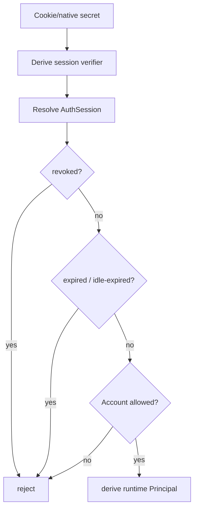

# DANTE Access/Auth Security Contract

- **Status:** CURRENT / BRANCH-LOCAL AUTHORITATIVE FOR ACCEPTED M2.1–M2.8 SECURITY DECISIONS
- **Workstream:** `feature/access-auth`
- **Scope:** browser session security, CSRF/CORS, credential lifecycle, password policy/storage, email security, passkey readiness, logging and revocation semantics
- **Does not authorize:** production Auth implementation before M2 closure

This document is the durable security contract for Access/Auth decisions already accepted in M2.1–M2.8. It complements `access-auth-architecture.md` and does not duplicate the full PostgreSQL persistence constitution.

All implementation must preserve stronger current DANTE security, persistence and documentation authorities.

---

## 1. Security objectives

Access/Auth must resist at least:

```text
credential theft / stuffing / brute force
session theft / fixation / replay
CSRF
account enumeration
provider-account takeover through email coincidence
recovery-token replay
password reset/session races
credential-change/session races
passkey ceremony replay
unsafe account/session revocation behavior
secret leakage through logs/URLs/client storage
unbounded KDF/resource exhaustion
```

Security controls must preserve consumer-grade UX and multi-device use. Security theater that adds complexity without reducing a real threat is not selected.

---

## 2. Browser session transport

The normal Web boundary uses a server-authoritative opaque session.

### 2.1 Session secret

On successful sign-in:

```text
CSPRNG 256-bit opaque secret
        │
        ├────────────► browser secure cookie
        │
        ▼
SHA-256(secret)
        │
        ▼
indexed AuthSession verifier in PostgreSQL
```

The raw secret is never stored in PostgreSQL or application logs.

SHA-256 is appropriate for the verifier because the session token is high-entropy random material, not a human password. Memory-hard password hashing is therefore unnecessary for the session verifier.

A stable non-secret AuthSession identifier remains separate from the secret/verifier for observability and future session-management UX.

### 2.2 Web cookie

Production direction:

```http
Set-Cookie: __Host-dante-session=<opaque-secret>; Secure; HttpOnly; Path=/; SameSite=Lax; Max-Age=2592000
```

Rules:

```text
Secure               required in production
HttpOnly             required
Path                  /
Domain                absent
host-only             yes
SameSite              Lax
JavaScript access     no
localStorage token    forbidden
sessionStorage token  forbidden
IndexedDB auth token  forbidden
token in URL          forbidden
```

The `__Host-` prefix is selected to enforce host-only scope and `/` path semantics in compliant browsers.

`SameSite=Lax` is selected rather than relying on `Strict` as the sole defense because DANTE must preserve practical provider/deep-link navigation while still implementing a real CSRF defense.

Provider-specific callback requirements must not weaken the main session cookie to `SameSite=None` globally. Provider flows use narrowly scoped protocol transaction state as required.

---

## 3. Session lifetime and activity

Accepted default policy:

```text
maximum session / reauthentication window  30 days
inactive-session threshold                 30 days
background polling counts as activity      NO
server expiry authority                    YES
cookie Max-Age                             <= authoritative maximum
```

`last_seen_at` and `last_user_activity_at` are not the same concept.

Background refresh/polling must not indefinitely keep an abandoned session alive. Activity persistence may be throttled to avoid a database write on every user action; the exact mechanism is owned by M3 transaction/session behavior.

Session durations are policy/configuration, not hardcoded schema meaning. Future high-security/enterprise profiles may adopt shorter windows without changing AuthSession semantics.

---

## 4. Session validation

Every authenticated request must derive authority from canonical server-side state.



This provides immediate revocation and account-disable enforcement without waiting for a self-contained browser JWT to expire.

A future cache may accelerate lookups only if it preserves the same authoritative revocation/session semantics.

---

## 5. CSRF contract

Authenticated browser mutations use layered CSRF defense.

For state-changing methods such as POST/PUT/PATCH/DELETE:

```text
expected content type
+ exact trusted Origin validation
+ Fetch Metadata validation
+ session-bound synchronizer CSRF token
+ valid AuthSession
```

### 5.1 Synchronizer token

DANTE is stateful, so a session-bound synchronizer token is preferred to a naive double-submit design.

Current application contract:

```text
GET /api/v1/auth/session
→ may return csrfToken for authenticated browser bootstrap

frontend
→ keeps token in memory

unsafe mutation
→ X-Dante-CSRF: <token>
```

The token must be unpredictable, associated with the AuthSession, verified securely, absent from URLs and redacted from logs.

Its concrete storage/derivation is materialized only when M3 persistence is designed.

### 5.2 Origin and Fetch Metadata

Unsafe authenticated browser requests require exact expected Origin behavior.

`Sec-Fetch-Site: same-origin` is the normal accepted browser posture.

A sibling subdomain is not automatically trusted merely because Fetch Metadata reports `same-site`.

`cross-site` unsafe requests are rejected. Missing reliable browser origin signals on unsafe mutation fail closed unless an explicitly reviewed protocol exception exists.

Referer may be a bounded fallback where browser behavior requires it; it is not a reason to accept ambiguous origins.

No state-changing operation uses GET.

### 5.3 Login CSRF

Pre-authentication sign-in cannot rely on an AuthSession CSRF token.

Normal email/password sign-in therefore requires:

```text
application/json
+ exact same-origin Origin validation
+ Fetch Metadata validation
+ required DANTE custom request header / application request contract
```

Provider authentication separately uses protocol state/nonce/PKCE as applicable.

---

## 6. CORS and trusted origin posture

Normal browser ingress is same-origin:

```text
CORS = disabled / no Access-Control-Allow-Origin by default
```

Never use:

```text
Access-Control-Allow-Origin: *
```

with credentials, and do not accept broad `*.dante.*` style browser-origin regexes as a default.

If an additional browser origin becomes a real requirement, it receives an explicit reviewed allow-list entry and threat analysis.

CORS is a browser control and is not the security model for Native clients.

---

## 7. Session fixation, rotation and reauthentication

Anonymous/pre-authentication state is never promoted into the authenticated AuthSession.

Successful sign-in always creates a fresh AuthSession and fresh session secret.

Successful reauthentication:

```text
keeps the same AuthSession identity
updates recent-auth/security context
refreshes the applicable session window
rotates the session secret
invalidates the previous secret
```

Rotation is also required on security-context changes where keeping the same bearer secret would unnecessarily preserve stolen-token usefulness.

DANTE does not rotate secrets continuously on an arbitrary short schedule where that would create races without meaningful threat reduction.

---

## 8. Revocation contract

### 8.1 Current logout

```text
revoke current AuthSession
+ clear browser cookie/native credential
+ idempotent result
```

Repeated logout/revoke must not produce corruption or 500-class failures.

### 8.2 Remote session operations

DANTE distinguishes:

```text
revoke specific session
revoke all other sessions
log out everywhere
```

Remote/session-wide security actions require recent authentication when initiated from authenticated account settings, except current logout which must always remain available.

### 8.3 Account disable

Account disable must atomically:

```text
mark Account unavailable
+ revoke all AuthSessions
```

All authentication methods are denied while disabled. Re-enable never resurrects historical sessions.

---

## 9. Password product policy

Accepted password rules:

```text
minimum                         15 Unicode code points
maximum                         1024 Unicode code points
maximum normalized UTF-8       4096 bytes
support >=64 characters        required
Unicode                         supported
normalization                   NFC
mandatory composition           none
paste/password manager          allowed / first-class
show/hide                       allowed
silent truncation               forbidden
trim/casefold                   forbidden
periodic forced change          not selected without security reason
```

Password is an exact secret. DANTE does not lowercase, trim, collapse spaces or silently truncate it.

Composition rules such as mandatory uppercase/number/symbol are not selected. Common/breached-password screening is the server-side quality authority rather than cosmetic composition checklists.

---

## 10. Password storage

### 10.1 Argon2id policy

Current selected policy:

```text
algorithm       Argon2id
Argon2 version  19
memory          65536 KiB / 64 MiB
iterations      3
parallelism     4
hash length     32 bytes
salt length     16 random bytes
```

Current library direction is maintained `argon2-cffi` compatible with the DANTE Python runtime. Exact dependency admission requires normal repository dependency/runtime proof.

Parameters are explicit DANTE policy, not implicit mutable library defaults.

### 10.2 Pepper

DANTE adds server-side defense in depth through a separately stored pepper.

Selected construction:

```text
NFC UTF-8 password
      │
      ▼
HMAC-SHA-256
key = random 256-bit DANTE password pepper
      │
      ▼
32-byte pre-hash result
      │
      ▼
Argon2id
```

Pepper must never be stored with the password verifier in PostgreSQL or committed to Git.

Production pepper belongs to a deployment secret-management boundary. LOCAL development uses a non-committed local secret mechanism.

A non-secret pepper key/version identifier may be persisted so normal key rotation can support transition.

If a pepper is actually compromised, opportunistic rehash alone is not considered remediation; forced password reset/security-incident policy applies.

### 10.3 Rehash-on-auth

On successful verification, the password component checks whether the stored verifier needs rehash under current policy.

Expensive verification/rehash may occur outside the DB transaction, but before session creation the application must re-lock/re-read authoritative state and prove that the PasswordCredential being acted on is still the credential that was verified.

If password reset/change raced and replaced the credential, authentication using the stale verified state aborts.

---

## 11. Password breach screening

Initial adapter direction: Have I Been Pwned Pwned Passwords range API using k-anonymity.

The raw password or full SHA-1 is never sent to HIBP.

```text
password
→ local SHA-1 only for HIBP protocol
→ send first 5 hexadecimal characters
→ receive candidate suffixes
→ compare full hash locally
```

Request padding is enabled where supported.

SHA-1 is **not** the password storage algorithm; it is only part of the HIBP privacy-preserving query protocol.

### 11.1 When screening is authoritative

Required on:

```text
signup/set password
authenticated password change
recovery reset
```

Any known breach count greater than zero rejects the proposed password.

Substring policing is not selected. DANTE evaluates the whole password against breach/common-password policy rather than rejecting arbitrary contained words.

### 11.2 Dependency degradation

When establishing a **new** PasswordCredential:

```text
HIBP unavailable
→ fail closed
→ retryable security/dependency failure
```

When verifying an **existing** password at login:

```text
correct credential + HIBP unavailable
→ fail open for auxiliary breach intelligence
→ security telemetry/metric
```

If an existing password is successfully verified and current breach intelligence now marks it compromised:

```text
no new AuthSession
→ password reset/change required
→ apply compromise/session policy
```

This prevents a transient external dependency from becoming a global login outage while still enforcing breach screening when creating credentials.

---

## 12. KDF resource-abuse controls

Argon2 is intentionally expensive and must not block the FastAPI event loop or be exposed as an unlimited memory-amplification primitive.

Required runtime posture:

```text
cheap validation/rate limiting first
→ bounded password-KDF worker capacity
→ Argon2 verification/hash
```

Unlimited ThreadPoolExecutor-style KDF concurrency is not selected.

Actual concurrency limits must be benchmarked on target deployment resources before production closure.

For unknown-account sign-in, DANTE performs a dummy Argon2 verification using the current policy to reduce obvious timing distinction from a known-account bad-password attempt. Rate limiting still occurs before expensive KDF work.

---

## 13. Password change and recovery lifecycle

### 13.1 Authenticated password change

Requires valid AuthSession + recent authentication.

Atomic security effect:

```text
replace PasswordCredential
+ revoke all other AuthSessions
+ retain current session if continuity is valid
+ rotate current secret
+ security event/notification capability
```

Replacing the current password with the exact current password is rejected. A persistent password-history table is not selected.

### 13.2 Recovery reset

Recovery reset is atomic:

```text
consume valid recovery proof
+ replace PasswordCredential
+ revoke all existing AuthSessions
```

No auto-login follows. The user performs fresh normal sign-in.

---

## 14. Email security contract

### 14.1 Identity comparison

Email comparison is deterministic DANTE policy, independent from display/delivery form.

Conceptual comparison key:

```text
local part → NFC + Unicode casefold
domain     → UTS #46 / IDNA canonical ASCII lowercase
```

PostgreSQL is the final uniqueness arbiter for the materialized current comparison key.

`citext` alone is not selected as the canonicalization strategy because it does not define the complete Unicode/IDNA/product policy.

### 14.2 No provider-specific alias rewriting

DANTE does not canonicalize Gmail dots, strip plus tags or rewrite provider domains as core identity behavior.

Anti-abuse controls solve abuse; identity normalization does not invent provider-specific equivalence.

### 14.3 Verification

`verified_at` proves control of that specific EmailIdentity. It does not automatically carry to a replacement address.

Verification/recovery proof flows require:

```text
strong random generation
bounded expiry
single use
replay resistance
race-safe consume
anti-enumeration where required
verifier/digest storage where possible
```

### 14.4 Email change

Before future strong-MFA policy is available, normal email change requires:

```text
valid session
+ recent authentication
+ old-email confirmation
+ new-email confirmation
+ old-email notification
+ pending transition
+ atomic final switch
```

Loss of access to the old email moves the user into account recovery; normal change semantics are not weakened to act as recovery.

The old email does not remain an invisible login/recovery alias after successful switch.

---

## 15. Provider security

Provider authentication and provider-data integration are separate security boundaries.

Authentication validates protocol-required evidence including, as applicable:

```text
state
nonce
PKCE
issuer
audience
signature
subject
callback/transaction replay state
```

External identity key:

```text
issuer + subject
```

Provider email alone never links Accounts.

Provider access/refresh tokens are not retained unless authentication itself has a reviewed bounded requirement for them. Gmail/Calendar/iCloud integration tokens must never be smuggled into the Auth model for convenience.

---

## 16. Passkey/WebAuthn security contract

Production implementation occurs in M5, but M3 must remain compatible with these accepted properties.

### 16.1 Ceremony requirements

```text
userVerification = required
user presence     required
challenge         32-byte CSPRNG direction
challenge expiry  bounded
challenge use     single ceremony / single use
origin check      required
RP ID check       required
credential check  required
signature check   required
replay            rejected
```

### 16.2 Privacy

DANTE never stores biometric templates, fingerprints, face data or device PINs.

Normal consumer attestation requirement is not selected. Consumer passkeys use an attestation-minimizing policy.

### 16.3 Credential characteristics

Synced and device-bound passkeys are supported. Backup eligibility/state are metadata/risk signals, not identity or an automatic trust level.

Signature-counter anomalies are risk/security signals. A non-increasing counter alone is not an unconditional account lock/failure rule.

---

## 17. Future MFA boundary

MFA implementation is deferred, but the security model must allow:

```text
TOTP
authenticator app
recovery codes
step-up
optional MFA
future mandatory/high-security policy
```

DANTE does not use a single core `mfa_enabled` Boolean as the full security model.

Recent authentication is assurance-aware: policy evaluates which evidence was verified, when, and with what properties.

---

## 18. Security events and user-facing security UX

The architecture must be able to emit or later materialize security events such as:

```text
new session
session revoked
password changed
password recovery completed
provider linked/unlinked
passkey added/removed
email changed
account disabled/re-enabled
```

M7 owns final security-event persistence/retention/notification hardening where not required earlier.

The product roadmap includes readiness for:

```text
active-session/device list
remote revoke
revoke all others
log out everywhere
new-login notification
"this wasn't me" response/recovery path
```

IP/User-Agent/device label/geolocation are metadata/risk signals only. Sessions are not hard-bound to IP and DANTE does not introduce invasive fingerprinting merely for apparent sophistication.

---

## 19. Logging and secret handling

Never log raw or derived secret-bearing material including:

```text
password
normalized password
password HMAC pre-hash
password pepper
session secret
session verifier where avoidable
Cookie
Set-Cookie
Authorization
X-Dante-CSRF
verification/recovery token
provider authorization code/token/assertion beyond reviewed safe metadata
PKCE verifier
WebAuthn challenge/credential secret material beyond safe identifiers
HIBP full SHA-1 or query prefix
```

Allowed observability includes non-secret values such as:

```text
request_id
non-secret Account/AuthSession identifiers where appropriate
stable machine security event code
safe provider/error category
```

Raw exception/SQL/stack/provider-secret detail never crosses the public API boundary.

---

## 20. Transaction/security ordering

Security-sensitive account-wide mutations must have deterministic transaction ordering.

Where locking is required, Account is the natural serialization point so races such as:

```text
signin vs password reset
signin vs account disable
password change vs session creation
recovery vs old credential use
```

resolve safely.

Example:

```text
LOGIN                          RESET
BEGIN                          BEGIN
lock Account                   lock Account
verify current state           consume proof
create session                 replace credential
COMMIT                         revoke sessions
                               COMMIT
```

Whichever obtains the lock/order first produces a result the second operation must re-evaluate against current canonical state.

External network calls and expensive crypto must not keep the database transaction open unnecessarily.

---

## 21. Security-specific rejected shortcuts

```text
raw session tokens in DB
JWT/localStorage default browser auth
wildcard credentialed CORS
SameSite as sole CSRF defense
main session cookie weakened for provider callback convenience
state-changing GET
session hard-binding to IP
provider email auto-link
password composition theater
periodic forced password rotation without cause
unbounded Argon2 concurrency
silent password truncation
browser-side HIBP password submission
password reset auto-login
password reset leaving old sessions alive
mfa_enabled as complete security posture
passkey == MFA unconditionally
biometric storage in DANTE
attestation required for every consumer passkey
signCount anomaly == automatic account lock
```

---

## 22. Standards/benchmark basis

This contract was cross-checked against current public guidance including:

- NIST SP 800-63B-4;
- OWASP Session Management Cheat Sheet;
- OWASP CSRF Prevention Cheat Sheet;
- OWASP Password Storage Cheat Sheet;
- OWASP Forgot Password / authentication guidance;
- RFC 9106 / Argon2 guidance as surfaced through maintained Argon2 implementations;
- W3C WebAuthn Level 3;
- MDN secure cookie guidance;
- Have I Been Pwned Pwned Passwords API privacy model;
- public security/session/passkey behavior documented by OpenAI, Notion, Linear and Todoist where useful as product benchmark.

These sources justify security direction but do not override stricter DANTE semantic/persistence rules.

---

## 23. Open decisions beyond this checkpoint

The following remain M2 work and are intentionally not guessed here:

```text
M2.9  exact M3 transaction/concurrency/session-expiry implementation contract
M2.10 OpenAPI → generated TypeScript client → Web application boundary
M2.11 exact M3 test matrix/full-stack harness
```

Security implementation begins only after those close, documentation is reconciled and a separate M3 production-code write gate is approved.