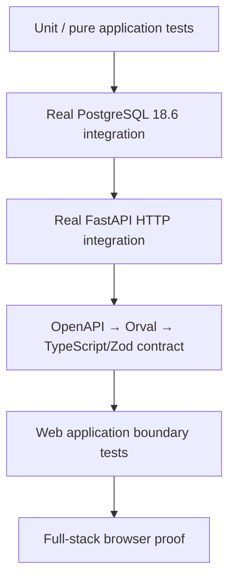
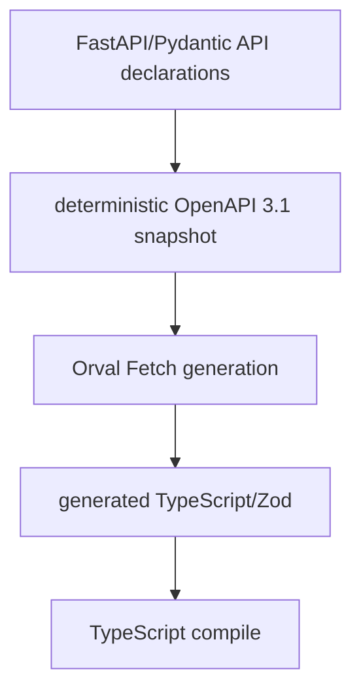
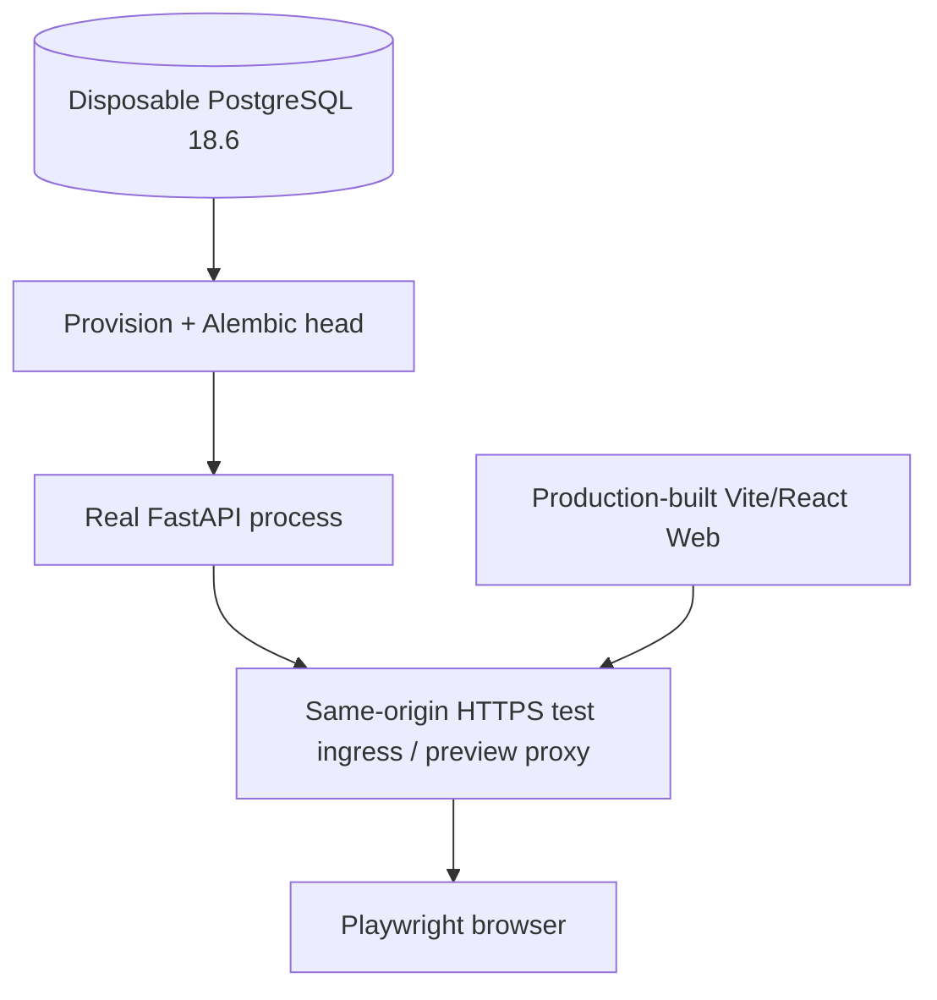

# DANTE Access/Auth Testing and Proof Contract

- **Status:** CURRENT / BRANCH-LOCAL AUTHORITATIVE FOR ACCEPTED M2.11 DECISIONS
- **Workstream:** `feature/access-auth`
- **Scope:** Access/Auth test layers, real-boundary proof, race/concurrency evidence, generated-contract drift, browser matrix and CI gate expectations
- **Does not authorize:** production Auth implementation outside the explicit M3 write gate

This document defines what must be proved before an Access/Auth executable slice can claim completion. It complements the Access/Auth architecture, security and API contracts and inherits the existing DANTE backend/frontend testing foundations rather than creating a second testing philosophy.

The central rule is:

```text
unit proof
!= PostgreSQL proof
!= HTTP/API proof
!= generated-contract proof
!= browser full-stack proof
```

No weaker layer may be used to claim a stronger boundary has been proved.

---

## 1. Definition of proof

M3 and later Access/Auth slices use the strongest practical evidence at each boundary.



A production Auth capability is not complete merely because mocked unit/component tests are green.

For the first M3 authenticated spine, the end-to-end proof target is:

```text
real browser
→ production-built React Web app
→ same-origin HTTPS test ingress
→ real generated DANTE client
→ real FastAPI process/HTTP
→ real Access/Auth application behavior
→ real SQLAlchemy async persistence
→ real PostgreSQL 18.6
```

---

## 2. Existing DANTE foundations to reuse

The current backend already provides a real PostgreSQL acceptance harness that:

```text
builds/uses dante-postgres-local:18.6
→ starts one disposable isolated PostgreSQL cluster
→ uses loopback random port
→ generates random admin/migrator/runtime secrets
→ creates fresh databases
→ provisions DANTE roles/security
→ installs the selected extension envelope
→ applies Alembic to repository head
→ destroys disposable state after tests
```

Access/Auth must reuse or extract this support. It must not create a second SQLite/fake/PostgreSQL-lite persistence path and must never mutate the ordinary persistent LOCAL DANTE database during automated acceptance tests.

Existing Backend CI remains authoritative for backend quality + PostgreSQL lanes. Existing Frontend CI remains authoritative for frontend quality/build/generated-source/Web-E2E/mobile-bundle lanes. M3 adds only the cross-stack proof that those independent gates cannot provide alone.

---

## 3. Unit / pure application tests

Use deterministic unit tests for rules that do not require transport or database semantics.

Coverage includes, as applicable:

```text
email normalization/comparison policy
password input/NFC/length policy
machine-problem → application failure mapping
session expiry calculations
activity-vs-background classification
recent-auth policy evaluation
Auth state transitions
request/result separation
security event classification
retryability interpretation
unknown-machine-code fallbacks
provider-independent authentication evidence policy
```

Do not mock away the behavior under test merely to increase count or coverage.

Coverage percentage remains diagnostic evidence, not the Definition of Done. DANTE does not introduce an arbitrary permanent 100% or other blanket percentage target for Auth.

---

## 4. Password/KDF test strategy

Argon2id is intentionally expensive; tests distinguish policy proof from unrelated application tests.

### 4.1 Fast tests

Application tests that do not validate the KDF itself may use an injected deterministic/fast test implementation behind the same port/contract.

They must not encode different semantic success/failure rules from production.

### 4.2 Real security proof

Dedicated security/integration tests must execute the production-selected construction:

```text
NFC password bytes
→ HMAC-SHA-256 with test-only ephemeral pepper
→ Argon2id v19
   m=65536 KiB
   t=3
   p=4
   hash length=32
   random salt length=16
```

At least the critical M3 happy-path signin must perform real production-parameter verification.

Also prove:

- wrong password rejection;
- verifier policy/rehash detection;
- stale credential recheck after expensive verification;
- bounded KDF concurrency behavior;
- unknown-account dummy verification path;
- no KDF execution on the event loop;
- known test secret material absent from logs.

Do not run hundreds of 64-MiB hashes where a cheaper isolated test proves unrelated behavior.

---

## 5. External dependency test doubles

Mandatory CI must be deterministic and must not depend on public Internet availability.

For HIBP and later mail/provider dependencies:

```text
DANTE real adapter/protocol implementation
→ protocol-faithful deterministic local substitute
```

The substitute may fake the external provider, but it must not bypass DANTE's internal adapter/application/security path.

For initial HIBP coverage prove at least:

```text
password absent from corpus
password present in corpus
dependency unavailable
malformed/unexpected dependency response
```

and the accepted policy split:

```text
new credential + HIBP unavailable
→ fail closed

existing valid password + HIBP unavailable
→ auxiliary intelligence fail open + telemetry
```

Never send real/user/UAT passwords to a public service from automated tests.

---

## 6. Real PostgreSQL integration proof

All persistence and concurrency-sensitive Auth behavior uses real PostgreSQL 18.6.

### 6.1 Migration/schema proof

Every structural M3 change must prove the normal DANTE same-change obligations, including:

```text
previous repository head → new head
fresh database → new head
single Alembic head
migration review / history discipline
SQLAlchemy metadata/mapping parity
Database Dictionary parity
human database reference parity
constraints/indexes
runtime ACL / least privilege
real PostgreSQL catalog parity
```

### 6.2 Constraint proof

The first materialized Auth slice must directly prove the exact constraints it introduces, expected to include as justified by the final schema:

```text
Account identity/lifecycle integrity
EmailIdentity comparison-key uniqueness
PasswordCredential current cardinality
AuthSession verifier uniqueness
foreign-key integrity
CHECK invariants
runtime-role allowed/denied operations
```

Application pre-checks are UX; database constraints remain final race arbiters.

### 6.3 Race tests

Concurrency tests use at least two independent real database sessions/connections and deterministic synchronization primitives/barriers.

Forbidden as primary synchronization:

```python
await sleep(0.1)  # hope the other transaction wins
```

Required M3 race scenarios include:

```text
two concurrent valid signins
→ both may create independent AuthSessions

signin verification vs password replacement/reset
→ stale authenticated credential cannot create a session

signin finalization vs Account disable
→ safe deterministic serialization

credential rehash vs replacement
→ stale rehash cannot overwrite new credential

session creation transaction failure
→ no partial canonical session

repeated/concurrent current-session revoke
→ terminal idempotent result

revoke/disable vs later session admission
→ post-commit admission denied
```

Use the accepted lock order and row-lock contract rather than timing accidents.

---

## 7. Transaction and ambiguous-outcome proof

Tests must distinguish:

```text
known rollback
known commit
ambiguous commit/outcome
```

No test or runtime code may convert a timeout/disconnect into an assumption that the transaction rolled back.

For AuthSession creation, the implementation generates a stable non-secret session reference before the authoritative transaction so an ambiguous commit can be reconciled by lookup of that reference when connectivity returns.

Prove:

- successful commit before `Set-Cookie` emission;
- no cookie on known rollback;
- reconciliation when the generated session reference is present after an ambiguous commit;
- no blind second session insert when outcome is indeterminate;
- an unreachable/unusable orphan session cannot give client authority when the raw secret was never delivered.

Fault-injection mechanics must be bounded, deterministic and must not mutate the normal LOCAL database.

---

## 8. API integration proof

Use real FastAPI application/middleware/routing behavior against canonical database state.

Fast in-process HTTP tests are appropriate for this layer; the later browser harness separately proves a real process/socket/proxy/browser boundary.

### 8.1 Signin

Prove at least:

```text
valid credentials
wrong password
unknown email
Account unavailable/disabled after sufficient proof
breached existing credential policy
HIBP degradation policy
rate limiting / abuse boundary as implemented
```

Unknown account and known-account wrong password must remain publicly equivalent under the anti-enumeration contract.

### 8.2 Session

Prove at least:

```text
valid session bootstrap
missing session
revoked session
overall expired session
inactive expired session
Account disabled after session creation
multiple independent sessions for one Account
```

### 8.3 Logout/revocation

Prove at least:

```text
current logout success
repeat logout success/idempotence
already-revoked current session
cookie clearing
other independent sessions survive current logout
```

### 8.4 CSRF/origin/security boundary

For unsafe Web operations prove:

```text
valid same-origin request + valid CSRF
missing CSRF
wrong CSRF
wrong Origin
cross-site Fetch Metadata
missing/unreliable required origin signals
expected content-type enforcement
no state-changing GET
```

Normal Web responses must not accidentally enable broad credentialed CORS.

### 8.5 Problem contract

For material errors prove:

```text
Content-Type: application/problem+json
RFC 9457 base members
stable DANTE code
category
request_id
retryable
errors[] where applicable
Retry-After where applicable
no raw stack/SQL/provider secret
```

The response `X-Request-ID` and problem-body `request_id` must agree.

---

## 9. Auth response cache policy

Access/Auth responses that establish, describe, rotate or revoke authentication/session state use a no-store cache posture.

Required direction:

```http
Cache-Control: no-store
```

At minimum this applies to signin, authenticated session bootstrap, logout/revocation, reauthentication and later sensitive recovery/security responses where session/security state is returned.

This is directly tested.

A blanket `Clear-Site-Data` response is not selected as the normal logout mechanism because it may destroy unrelated DANTE client preferences/cache/local state. Introduce it only through a separately justified security/product flow.

---

## 10. OpenAPI/generated-client proof

M2.10 defines the contract-generation path. M3 must make it executable.



CI must detect at least:

```text
backend API changed / committed OpenAPI stale
OpenAPI changed / generated client stale
hand-edited generated output
duplicate/unstable operationId
generated TypeScript no longer compiles
runtime response violates generated/validated contract
```

OpenAPI export must not require:

```text
live PostgreSQL
Google/Apple/HIBP/network
production secrets
running remote environment
```

Generator input in CI is the local governed OpenAPI artifact, not a DEV/UAT URL.

Generated-file determinism extends the existing repository `generated:check` philosophy instead of creating a conflicting second drift mechanism.

---

## 11. Web application-boundary tests

Web tests exercise the feature/application/data-source boundary without requiring a browser for every failure class.

Required examples include:

```text
auth.invalid_credentials
→ Access invalid-credentials result/state

rate_limit.exceeded
→ rate-limited behavior

network unavailable before HTTP response
→ client-local network_unavailable class

session expired/revoked
→ canonical authenticated state removed

unknown future machine code
→ category → HTTP-status → safe generic fallback

server response violates runtime schema
→ contract_violation

REQUEST_SIGNIN
→ never establishes authenticated state

SERVER_SIGNIN_SUCCESS
→ may establish authenticated handoff
```

Presentation/reducer tests do not import raw generated Orval files or issue `fetch()` directly.

---

## 12. Full-stack Web browser harness

The M3 full-stack harness orchestrates the real first-party stack in an isolated environment.



The harness may use Vite preview/dev proxy capabilities or another bounded test ingress, but the browser must observe one HTTPS application origin with `/api/v1/*` routed to FastAPI.

Use ephemeral test certificates/keys. They are test artifacts only and must not become repository or production trust material.

The browser harness must be capable of proving actual cookie attributes and browser behavior, not merely string-comparing a server header.

---

## 13. Core browser matrix

For the critical Auth spine, required browser engines are:

```text
Chromium
Firefox
WebKit
```

Do not multiply every visual/responsive test across all engines without value. Existing detailed visual/responsive Access coverage may keep an efficient matrix; the security-critical full-stack signin/session/bootstrap/logout spine runs across all three.

Playwright retries remain disabled for the critical Auth spine unless a future evidence-backed exception is introduced. A flaky Auth test is a defect to diagnose, not something to mask with automatic retry.

---

## 14. Core browser scenarios for M3

At minimum:

### 14.1 Real signin

```text
Access UI
→ submit real synthetic email/password
→ real generated client
→ FastAPI
→ PostgreSQL
→ Secure HttpOnly host-only session cookie
→ authenticated boundary
```

### 14.2 Reload/bootstrap

```text
signed in
→ hard/page reload
→ session bootstrap
→ still authenticated
```

### 14.3 Logout

```text
authenticated
→ logout
→ AuthSession revoked
→ cookie cleared
→ protected/authenticated boundary unavailable
```

### 14.4 Multiple sessions

Use separate Playwright `BrowserContext`s:

```text
Context A → signin → Session A
Context B → signin → Session B

logout A
→ A unauthenticated
→ B remains authenticated
```

### 14.5 Expiry/revocation

Controlled server-side test state makes a session expired/revoked; the next session admission/bootstrap must reject it and the UI must converge to unauthenticated state.

### 14.6 Negative/degraded paths

At least:

```text
wrong password
server/dependency unavailable
rate-limited response
```

must never produce a fake authenticated transition.

---

## 15. Authentication-state reuse in tests

The critical Access/Auth suite does not bypass signin with a shared committed Playwright `storageState` file.

Meaningful Auth scenarios begin unauthenticated and traverse the real signin path.

Later non-Auth product verticals may create isolated authentication fixtures to avoid re-testing signin in every unrelated scenario. Such fixture state is test support, never production authority, and any storage-state file containing session cookies must remain uncommitted/ephemeral.

---

## 16. Test data and support interfaces

Do not add public production endpoints such as:

```text
/test/create-user
/test/expire-session
```

merely to simplify E2E.

The harness may use dedicated test-support code outside the public runtime API to seed synthetic Accounts/credentials and manipulate bounded test-only state.

Requirements:

```text
synthetic random identities only
ephemeral test passwords/pepper/secrets
no real user email
no UAT/PROD credential
no ordinary LOCAL DB mutation
cleanup guaranteed
```

Where possible seed through the same real persistence/security primitives used by production, while avoiding unnecessary calls through the public product API that would make tests circular or slow.

---

## 17. Secret/log/artifact proof

Known synthetic canary values are used to test redaction.

Backend logs/telemetry produced by relevant Auth tests must not contain:

```text
raw password
session secret
CSRF token
Cookie header value
Set-Cookie secret value
password pepper
verification/recovery secret
HIBP full SHA-1/prefix
provider code/token/assertion secret
```

`request_id`, non-secret Account/AuthSession references and safe machine event codes may be present.

Playwright traces/screenshots/videos from Auth tests may contain synthetic disposable data. CI retention stays short/bounded and those artifacts must never contain production/UAT credentials.

---

## 18. CI ownership

Existing gates remain separate:

```text
Backend CI Gate
Frontend CI Gate
```

M3 adds a cross-stack Access/Auth gate for obligations no single existing lane can prove.

Conceptual shape:

```text
Access/Auth Contract
├── deterministic OpenAPI
├── deterministic Orval output
├── generated TypeScript/Zod compile
└── architecture/dependency boundaries

Access/Auth Full Stack
├── PostgreSQL 18.6
├── FastAPI
├── same-origin HTTPS Web
├── Chromium
├── Firefox
└── WebKit

        ↓
Access/Auth CI Gate
```

M3 closure requires all applicable existing and new gates green at the executed candidate:

```text
Backend CI Gate
Frontend CI Gate
Access/Auth CI Gate
```

The new gate must not duplicate whole Backend/Frontend suites merely to create one giant workflow. It owns cross-stack evidence.

---

## 19. Security test coverage map

Access/Auth tests map concrete accepted threats/invariants rather than claiming a generic “OWASP test”.

At least relevant categories include:

```text
authentication
session management
CSRF/origin enforcement
input validation
error disclosure
credential/secret handling
rate/resource abuse
replay
transaction/race behavior
provider/linking boundaries when activated
```

OWASP/NIST/W3C/provider guidance may supply test ideas, but DANTE's accepted contracts define pass/fail semantics.

---

## 20. Slice closure checklist

An executable Access/Auth slice is not CLOSED until all applicable items pass:

```text
[ ] product/application states and intents explicit
[ ] accepted semantic/security architecture preserved
[ ] persistence minimal and slice-justified
[ ] migration/mapping/Dictionary/reference aligned
[ ] DB constraints/indexes/ACL proved on real PostgreSQL
[ ] transaction boundaries explicit
[ ] concurrency/replay/idempotency scenarios directly proved
[ ] API status/problem/machine semantics documented and proved
[ ] security headers/cookie/CSRF/origin behavior proved
[ ] OpenAPI matches implementation
[ ] generated client regenerated deterministically
[ ] generated/client/runtime contract validation passes
[ ] Web consumes through application/data-source boundary
[ ] frontend never invents server-authoritative success
[ ] unit/application tests pass
[ ] real PostgreSQL tests pass
[ ] API integration tests pass
[ ] critical browser full-stack tests pass
[ ] accessibility/i18n/responsive regressions applicable to changed surface pass
[ ] known secret canaries absent from logs/artifacts
[ ] CI gates applicable to the slice are green
[ ] durable documentation and workstream state reconciled
[ ] exact write-scope/readback QA passes
```

“Happy path works” or “coverage is high” is never sufficient by itself.

---

## 21. Rejected testing shortcuts

```text
SQLite as Auth/PostgreSQL behavioral substitute
persistent developer LOCAL database in automated acceptance
mocking FastAPI/DB in the only E2E path
browser test against static fake-success Auth
race tests synchronized by arbitrary sleeps
live HIBP/provider dependency in mandatory CI
committed authenticated Playwright storageState for Auth-spine tests
public production /test/* endpoints
automatic Playwright retries masking nondeterminism
coverage percentage as security proof
one-browser-only critical Auth proof
hand-edited generated client/OpenAPI
```

---

## 22. Reopen discipline

Reopen the smallest testing choice when direct evidence shows a harness cannot truthfully reproduce the boundary it claims to test.

Examples that may justify a bounded reopen:

- a browser engine cannot exercise a platform-specific capability relevant to the selected flow;
- target deployment topology introduces a security boundary not represented by the current same-origin harness;
- an external protocol cannot be tested faithfully without provider sandbox evidence;
- deterministic race orchestration proves insufficient for a newly introduced invariant.

Test convenience, suite duration alone, or a desire to reduce CI jobs is not sufficient to remove a proof layer that owns a unique production risk.
