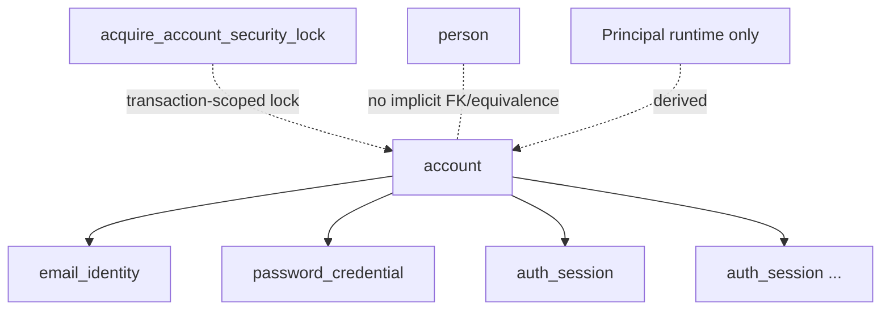

# DANTE Access/Auth Database Reference

- **Status:** CURRENT / BRANCH-LOCAL / M3 BACKEND SPINE MATERIALIZED + DIRECT REAL POSTGRESQL PROOF PASS
- **Branch:** `feature/access-auth`
- **Current Alembic head on this branch:** `20260827_10`
- **Protected-main CP6 baseline:** `20260826_08`
- **Whole-DB current reference:** `dante-postgresql-database.md` + continuations
- **Database system-of-record authority:** `README.md`
- **Architecture authority:** `../architecture/access-auth-architecture.md`
- **Security authority:** `../architecture/access-auth-security-contract.md`
- **Persistence doctrine:** `../development/backend-cp6-02-postgresql-persistence-constitution.md`

## 1. Purpose

This document is the detailed current Access/Auth module of the DANTE Database System of Record. It is **not** a detached post-CP6 amendment and it does not replace the whole-DB reference. The whole-DB reference accounts for Access/Auth topology and resolved former deferrals; this file owns the detailed schema meaning for the Access/Auth persistence introduced by M3-A and the bounded account-security locking capability added by the M3 backend spine.

The documentation relationship is:

```text
docs/database/README.md
→ Database System of Record / authority + lifecycle

whole-DB current/evolving reference
→ dante-postgresql-database.md + continuations
→ global topology, cross-family invariants, resolved/open whole-DB questions

this file
→ detailed Access/Auth DB topology and object semantics

Dictionary + SQLAlchemy + Alembic + real PostgreSQL + tests
→ machine/executable/observed representations and proof
```

Historical CP6 reasons for deferring Account persistence remain useful rationale, but `DB-U09` is no longer a current unresolved item on this branch: its trigger was satisfied by the closed Access/Auth architecture and M3-A materialization. `DB-U10` is likewise resolved **without** a Principal table because Principal remains runtime-derived security context.

This module does not reinterpret Domain, Logical, Physical or the PostgreSQL Persistence Constitution.

The first M3 backend spine materializes only the persistence/capability required for email/password signin and server-authoritative session admission:

```text
Account
├── EmailIdentity
├── 0..1 PasswordCredential
└── 0..N AuthSession

bounded DB capability
└── acquire_account_security_lock(uuid)
```

Deliberately not materialized here:

```text
ExternalIdentity
PasskeyCredential
recovery/verification proof tables
TOTP / MFA / recovery codes
Principal table
Account ↔ Person convenience relation
```

`Person != Account != Principal != Actor` remains mandatory. `AuthSession != dante.session` remains mandatory.

## 2. Current topology



All four new stable row identifiers use application-issued UUIDv7 values. That UUID format does **not** make them `NativeRef`; Access/Auth references are their own security/application identities.

## 3. `dante.account`

Role: durable Access/security lifecycle root.

Columns:

```text
account_ref   uuid        PK, UUIDv7
status_code   text        active | disabled
created_at    timestamptz finite
disabled_at   timestamptz nullable
```

Integrity:

```text
active   → disabled_at IS NULL
disabled → disabled_at finite and >= created_at
```

The table intentionally contains no email, password verifier, provider identifier, Person/profile payload, device identity or global role.

Current runtime ACL:

```text
SELECT  yes
INSERT  no
UPDATE  no
DELETE  no
```

The runtime therefore cannot acquire a row lock through direct `SELECT ... FOR UPDATE`, because PostgreSQL requires the corresponding table UPDATE privilege. M3 keeps Account UPDATE denied and exposes only the narrow migration-owned `dante.acquire_account_security_lock(uuid)` capability for transaction-scoped account-security serialization.

Account creation/disable mutation surfaces belong to later slices and receive their own least-privilege evolution.

## 4. `dante.email_identity`

Role: canonical DANTE login/contact email identity representation for an Account.

Columns:

```text
email_identity_ref uuid        PK, UUIDv7
account_ref        uuid        FK → account
address            text        normalized delivery/display form
comparison_key     text        UNIQUE canonical lookup/identity key
created_at         timestamptz finite
verified_at        timestamptz nullable, finite and >= created_at
```

`address` and `comparison_key` are deliberately separate. Application normalization/comparison policy remains:

```text
local comparison  NFC + Unicode casefold
domain comparison UTS #46 / IDNA canonical ASCII lowercase
```

PostgreSQL is the final concurrency arbiter through `uq_email_identity_comparison_key`.

Explicit index:

```text
ix_email_identity_account_ref(account_ref)
```

Current runtime ACL is SELECT only. Signup/email-change mutations are not opened early.

## 5. `dante.password_credential`

Role: optional current password credential for an Account.

Columns:

```text
password_credential_ref uuid        PK, UUIDv7
account_ref             uuid        FK → account, UNIQUE
verifier                text        Argon2id encoded verifier
pepper_key_id           text        non-secret external pepper-key identifier
created_at              timestamptz finite
updated_at              timestamptz finite and >= created_at
```

`UNIQUE(account_ref)` enforces the accepted `Account → 0..1 current PasswordCredential` cardinality.

The verifier check requires an Argon2id v19 encoded shape. This is database shape defense only; exact algorithm parameters are application security policy and remain explicit in the Auth password implementation.

Never persisted:

```text
raw password
normalized password bytes
pepper secret
HIBP protocol material
```

Current runtime ACL:

```text
SELECT                                      yes
UPDATE verifier, pepper_key_id, updated_at  yes
INSERT                                      no
DELETE                                      no
```

The narrow UPDATE exists for authenticated verifier upgrade/rehash after authoritative stale-credential revalidation. Account binding and credential identity cannot be changed by the runtime role.

## 6. `dante.auth_session`

Role: one independent server-authoritative authentication session for one Account.

Columns:

```text
auth_session_ref       uuid        PK, UUIDv7; non-secret correlation identity
account_ref            uuid        FK → account
secret_verifier        bytea       UNIQUE, exactly 32 bytes
created_at             timestamptz
authenticated_at       timestamptz
recent_auth_at         timestamptz
last_user_activity_at  timestamptz
expires_at             timestamptz
revoked_at             timestamptz nullable
revocation_reason_code text        nullable
```

`secret_verifier` stores SHA-256 of a CSPRNG 256-bit session secret. The raw secret is returned only through the approved client transport after durable commit/reconciliation and is never stored in PostgreSQL.

Chronology checks require finite timestamps and coherent ordering. Revocation is represented terminally as a paired timestamp + non-empty reason code.

Current usability remains derived:

```text
not revoked
AND within authoritative expiry
AND within inactivity policy
AND owning Account is usable
```

There is intentionally no redundant mutable `EXPIRED` status flag.

Indexes:

```text
uq_auth_session_secret_verifier(secret_verifier)  unique lookup/integrity
ix_auth_session_account_ref(account_ref)           account session enumeration/revocation
```

Current runtime ACL:

```text
SELECT                                                   yes
INSERT                                                   yes
UPDATE last_user_activity_at, revoked_at,
       revocation_reason_code                            yes
UPDATE secret/account/session identity or auth timestamps no
DELETE                                                   no
```

Session-secret rotation on reauthentication is not opened by this ACL because reauthentication belongs to a later slice.

## 7. Foreign-key and deletion posture

M3-A adds exactly three FKs:

```text
email_identity.account_ref       → account.account_ref
password_credential.account_ref  → account.account_ref
auth_session.account_ref         → account.account_ref
```

All use `NO ACTION` update/delete behavior. Security identity/session history is not cascade-deleted implicitly.

No runtime DELETE is granted on the new tables. Current logout is represented by terminal `AuthSession` revocation, not physical deletion.

## 8. Transaction/concurrency relationship

The schema plus migration `20260827_10` support the M2.9 signin contract; they do not replace application-level transaction ownership.

```text
short read
→ EmailIdentity / Account / PasswordCredential snapshot
→ expensive Argon2 + external breach intelligence outside DB transaction
→ BEGIN
→ SELECT dante.acquire_account_security_lock(account_ref)
→ re-read Account + current PasswordCredential
→ prove the authenticated credential is still current
→ insert AuthSession
→ COMMIT or reconcile ambiguous outcome with a fresh session
→ only then issue raw Web session secret
```

`dante.acquire_account_security_lock(uuid)` is a deliberately narrow `SECURITY DEFINER` function owned by `dante_owner`, with exact trusted search path and direct EXECUTE granted only to `dante_runtime`. It takes the canonical Account row lock inside the caller's transaction while preserving deny-by-default direct Account mutation privileges.

Account is the natural serialization row for account-wide security mutations. Normal authenticated request admission remains a read path and does not lock Account merely to authenticate.

Two legitimate concurrent signins may create two independent AuthSessions. Reset/disable races must be serialized/revalidated by the application operation when those mutations materialize.

## 9. Dictionary / mapping / Alembic traceability

Migrations:

```text
20260827_09_m3_auth_signin_spine.py
→ Account / EmailIdentity / PasswordCredential / AuthSession

20260827_10_m3_auth_security_lock.py
→ acquire_account_security_lock(uuid)
```

SQLAlchemy mapping:

```text
dante.platform.database.mappings.auth
├── AccountRow
├── EmailIdentityRow
├── PasswordCredentialRow
└── AuthSessionRow
```

Dictionary:

```text
dictionary/tables/account.json
dictionary/tables/email_identity.json
dictionary/tables/password_credential.json
dictionary/tables/auth_session.json
dictionary/routines/acquire_account_security_lock.json
```

The Dictionary v1 schema was generalized at the first post-CP6 evolution so `introducing_stage`/`runtime_acl_stage` can truthfully identify later product stages such as `M3-A` instead of pretending new objects belonged to CP6.

## 10. Protected-main baseline vs current branch

CP6 remains exact historical/acceptance evidence at Alembic `20260826_08`; it is not the ceiling of the evolving database reference:

```text
                         CP6 baseline   M3 backend current
tables                   68             72
views                     5              5
routines                  14             15
standalone entries        87             92
triggers                  75             75
physical indexes          95             104
foreign keys              68             71
CHECK constraints         120            137
```

`docs/database/dictionary/scope.json` deliberately records both:

```text
expected_baseline
→ immutable CP6 closure benchmark

current_materialization
→ current branch database inventory
```

Post-CP6 growth must never rewrite CP6 acceptance evidence merely to make current counts fit. Equally, the whole-DB current reference must not keep a resolved product/database question marked as current `DEFERRED` merely because CP6 originally deferred it.

## 11. Former whole-DB deferral resolution

M3-A is the first concrete use of the permanent current-reference reconciliation rule.

```text
DB-U09 — Account persistence
CP6 disposition:
→ DEFERRED correctly because Access/Auth semantics were not closed.

Current branch resolution:
→ RESOLVED / MATERIALIZED by Access/Auth M2 architecture + M3-A.
→ dante.account
→ dante.email_identity
→ dante.password_credential
→ dante.auth_session
→ first migration 20260827_09

DB-U10 — Principal/security persistence
CP6 disposition:
→ DEFERRED correctly because AuthN/AuthZ runtime context was not closed.

Current resolution:
→ RESOLVED WITHOUT PERSISTENCE.
→ Principal is runtime-derived from Account + AuthSession + request/security context.
→ no Principal table is selected.
```

These resolutions do not collapse `Person`, `Account`, `Principal` or `Actor` and do not retroactively make CP6's original decision wrong. They update the current reference because the explicit future trigger has now fired.

## 12. Direct proof obligations

Repository tests are structured as distinct authorities:

```text
test_cp6_final_catalog.py
→ migrate a fresh database explicitly to 20260826_08
→ prove the CP6 topology independently of later evolution

test_current_catalog.py
→ migrate to repository head
→ prove current Dictionary ≈ SQLAlchemy ≈ Alembic ≈ live PostgreSQL
→ prove exact Auth runtime ACLs
→ prove the narrow Account security-lock capability and transaction-scoped row lock

test_migrations.py
→ prove the single current head, fresh upgrade, round trip and Alembic drift check

test_signin_session.py
→ prove real signin/session/bootstrap/logout behavior against disposable PostgreSQL 18.6
```

Required real execution uses the existing disposable PostgreSQL 18.6 acceptance harness. Static review of these files is not a PASS substitute.

The M3 backend PostgreSQL execution completed successfully on 2026-08-28:

```text
real PostgreSQL marked suite                                         PASS / 83 of 83
real signin/session integration                                      PASS / 4 of 4
CP6 M1..M7 historical regression                                    PASS
current catalog / Auth ACL / Account security lock                   PASS
migration fresh-head / round-trip / Alembic drift                    PASS
privilege / runtime / transaction suites                             PASS
current Dictionary ≈ SQLAlchemy ≈ Alembic ≈ live PostgreSQL         PASS
```

The same backend checkpoint had already passed the fast non-PostgreSQL suite (`73/73`), Ruff lint, mypy strict and package build before the final PostgreSQL-only test reconciliations. Those final reconciliations touched only historical/runtime test code and the final real PostgreSQL suite passed at branch HEAD.

## 13. Current evidence boundary

The branch has now materialized **and directly proved the M3 backend signin/session spine**.

Directly proved:

```text
Alembic head 20260827_10 / migration runtime                         PASS
PostgreSQL current catalog                                           PASS
frozen CP6 catalog/baseline behavior                                 PASS
Dictionary ≈ SQLAlchemy ≈ Alembic ≈ live PostgreSQL                  PASS
exact Auth runtime ACL                                               PASS
narrow Account security-lock capability                              PASS
real email/password signin against PostgreSQL                        PASS
unknown email / wrong-password public equivalence                    PASS
real AuthSession creation/bootstrap                                  PASS
current-session logout + independent second-session survival         PASS
Origin / content-type / CSRF / duplicate-cookie negative behavior    PASS
runtime DB outage/readiness recovery                                  PASS
transaction semantics                                                 PASS
```

Still outside this backend/database checkpoint:

```text
deterministic committed Auth OpenAPI snapshot
generated Orval Fetch / @dante/api-client
Web transport/application boundary
Access signin/bootstrap/logout UI wiring
same-origin HTTPS browser proof
Chromium / Firefox / WebKit full-stack proof
whole M3 exit gate
```

The backend PASS must therefore not be inflated into a claim that the whole M3 full-stack vertical is closed.
